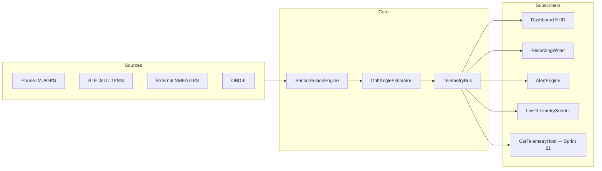

# ExpeditionGauge — Architecture & BUILD_PLAN

## Current state

- Android app under [`examples/android/`](examples/android/) (`dev.foss.expeditiongauge`) — Compose HUD, Room, BLE/GPS/OBD, playback, polish waves, v2 live telemetry.
- **Shipped:** core v1 (Sprints 0–8), polish v1.1–v1.2 (9–17b), v2 video + wizards (18), live telemetry v2.1.0 (19). Details in [`COMPLETED_TASKS.md`](COMPLETED_TASKS.md).
- **Known issue:** `MainActivity` calls `enableEdgeToEdge()` without compose inset padding — bottom controls clip under nav bar (**Sprint 19b**).
- **Next:** Sprint 19b (insets) → 20 (dual-orientation) → 21 (Android Auto) → 22–27 (Relive-style sharing).
- **Dev device:** OnePlus 12 · USB ADB · serial `b5214fc6` · rooted (dev only). See [`docs/DEV_DEVICE.md`](docs/DEV_DEVICE.md).

---

## Plan persistence (survives Cursor reopen / repo sync)

**Canonical source of truth (git-tracked):**

| File | Purpose |
|------|---------|
| [`BUILD_PLAN.md`](BUILD_PLAN.md) | Active sprint board — **always edit here** |
| [`project.config.json`](project.config.json) | Sprint toggles, release repo, dev device |
| [`docs/START_HERE.md`](docs/START_HERE.md) | Agent cold-start read order |
| [`.cursor/rules/expeditiongauge-plan.mdc`](.cursor/rules/expeditiongauge-plan.mdc) | Session-start rule |

**After Cursor reopen:** `pwsh scripts/expedition/resume-agent.ps1` → next `🔲 [AGENT]` row. **Never** depend on `.cursor/plans/*.plan.md`.

CI: [`.github/workflows/verify-plan.yml`](.github/workflows/verify-plan.yml) runs `verify-plan-persisted.ps1`.

---

## Automation-first: zero `[HUMAN]` rows

Every bootstrap task is **AGENT + AUTO + ADB**. Numbered BUILD_PLAN rows use `[AGENT]`, `[AUTO]`, or `[ADB]` only — no `🔲 [HUMAN]` numbered tasks. Product gates (e.g. Android Auto metric priority) use bullet notes or maintainer docs, not numbered rows.

### HUMAN → AUTO/AGENT conversion matrix

| Former HUMAN task | New owner | Script / mechanism |
|-------------------|-----------|-------------------|
| Template / clone / placeholders | AGENT + AUTO | `bootstrap.ps1`, `sync-project-config.ps1` |
| ADR approval | AUTO | `accept-adr.ps1` + `check-adr-gate.ps1` |
| Sprint / wave scope | AUTO | `project.config.json` → `sprints.*` |
| Sign-offs / releases | AUTO | `sprint-signoff.ps1`, `create-release.ps1` |
| Mark tasks done | AUTO | `mark-task.ps1` |
| **`gh auth login`** | AUTO (gate) | `ensure-gh-auth.ps1` — blocker doc only |

### Expedition script catalog

| Script | Purpose |
|--------|---------|
| `resume-agent.ps1` | Next `🔲 [AGENT]` row + session state |
| `verify-plan-persisted.ps1` | CI guard — required sections + no forbidden rows |
| `sprint-signoff.ps1` | Per-sprint gates + `mark-task.ps1` |
| `check-adr-gate.ps1` | Sprint→ADR map (1→0001+0003, 5b→0007, 5c→0008, 10→0002, 15→0004, 18→0005, 19→0006, 20→0009, 21→0010, 22→0011, 25+26→0012) |
| `adb-smoke.ps1` | Device scenarios (`cold-start`, `nav-insets-*`, `live-*`, …) |
| `create-release.ps1` | `gh release create` when auth ready |

Full catalog: [`scripts/expedition/`](scripts/expedition/).

### `project.config.json` sprint toggles

| Toggle | Sprints |
|--------|---------|
| `core_v1` | 0–8 |
| `wave1_polish` / `wave2_polish` | 9–14 / 15–17 |
| `v2_video` / `v2_live_telemetry` | 18 / 19 |
| `system_ui_insets` | **19b** (on — ship before 20) |
| `v2_dual_orientation` / `v2_android_auto` | 20 / 21 |
| `v2_media_attach` … `v2_sharing_polish` | 22–27 |

### Irreducible blockers (NOT plan rows)

- **`gh auth`** — `ensure-gh-auth.ps1` exit 2
- **No ADB device** — `adb-wait-device.ps1`
- **Two-device live / long thermal** — manual; documented in COMPLETED_TASKS Sprint 19

---

## Architecture decision (ADR-0001 proposal)

**Accepted ADRs:** 0001–0008 (core + polish), 0005–0006 (v2 video + live). Pending: 0009 (orientation), 0010 (Android Auto), 0011 (media), 0012 (video pipelines).

| Layer | Choice |
|-------|--------|
| UI | Jetpack Compose + Canvas gauges; MapLibre playback map |
| State | ViewModels + DataStore; Room for sessions |
| Sensors | `TelemetryBus` / `ExpeditionGaugeServices` — single fusion pipeline |
| BLE | IMU GATT + TPMS scan + Classic SPP external GPS; `BleConnectionBudget` |
| OBD | Classic Bluetooth ELM327; tire slip ≠ drift angle β |
| Privacy | Local-only default; live telemetry opt-in P2P (Sprint 19) |
| FOSS | No Play Services / Firebase in APK; AA uses user-installed host app |

**Deep dives (do not duplicate here):**

| Topic | Doc |
|-------|-----|
| Gauge layout | [`docs/design/GAUGE_REFERENCE.md`](docs/design/GAUGE_REFERENCE.md) |
| Drift playback | [`docs/design/DRIFT_PLAYBACK.md`](docs/design/DRIFT_PLAYBACK.md) |
| Telemetry bus | [`docs/EXTENSION_POINTS.md`](docs/EXTENSION_POINTS.md) |
| Thermal | [`docs/THERMAL_PERFORMANCE.md`](docs/THERMAL_PERFORMANCE.md) |
| Live UX | [`docs/design/LIVE_TELEMETRY_UX.md`](docs/design/LIVE_TELEMETRY_UX.md) |
| Recommendations traceability | [`docs/RECOMMENDATIONS.md`](docs/RECOMMENDATIONS.md) |
| Roadmap / deferred | [`docs/ROADMAP.md`](docs/ROADMAP.md) |
| All ADRs | [`docs/adr/`](docs/adr/) |
| Feature specs | [`docs/features/`](docs/features/) |

---

## Modular telemetry pipeline (central architecture)

**Rules:** One bus; pluggable subscribers; phone-only fallback explicit; β (drift) ≠ slipRatio (tire slip).

---

## Archived sprints

| Sprint | Complete | Archive |
|--------|----------|---------|
| 0–8 | 2026-06-30 | [`COMPLETED_TASKS.md`](COMPLETED_TASKS.md) |
| 9–17b | 2026-06-30 | [`COMPLETED_TASKS.md`](COMPLETED_TASKS.md) |
| 18–19 | 2026-06-30 | [`COMPLETED_TASKS.md`](COMPLETED_TASKS.md) |

> **Sprints 0–19** — all AGENT/AUTO work archived. v2.1.0 live telemetry shipped (`versionCode` 5). Release tag deferred until `gh` auth + maintainer approval.

---

## Proposed BUILD_PLAN.md sprints

### Sprint 0 — Template Customization + Plan Materialization

> **Sprint 0** archived in [`COMPLETED_TASKS.md`](COMPLETED_TASKS.md) @ 2026-06-30.

### Sprint 1 — Foundation + ADR

> **Sprint 1** archived in [`COMPLETED_TASKS.md`](COMPLETED_TASKS.md) @ 2026-06-30.

### Sprints 2–17b — Core v1 + polish

> **Sprints 2–17b** archived in [`COMPLETED_TASKS.md`](COMPLETED_TASKS.md) @ 2026-06-30.

### Sprint 18 — Video Sync + Wizards + Enhanced Export

> **Sprint 18** archived in [`COMPLETED_TASKS.md`](COMPLETED_TASKS.md) @ 2026-06-30 (v2.0.0).

### Sprint 19 — Live Telemetry (Sender / Receiver)

> **Sprint 19** archived in [`COMPLETED_TASKS.md`](COMPLETED_TASKS.md) @ 2026-06-30 (v2.1.0). ⏸ Release tag + two-device cellular/hotspot smokes deferred.

---

## Active board — Sprint 19b+

### Sprint 19b — System UI / navigation bar insets (v2.1.1 patch)

> Requires `sprints.system_ui_insets: true`. **Blocks Sprint 20** until sign-off. Spec: [`docs/features/system-ui-insets.md`](docs/features/system-ui-insets.md) (create in step 1).

**Approach:** Keep `enableEdgeToEdge()`; add `InsetAwareScaffold`; `navigationBars` padding on bottom bars only; MapLibre `setPadding`; Material3 sheet `contentWindowInsets`.

**Sequential:**

1. 🔲 [AGENT] `docs/features/system-ui-insets.md` — inset contract + screen audit checklist
2. 🔲 [AGENT] Audit screens: Dashboard, Playback, Settings, sessions, `LivePairingSheet`, onboarding, permissions, About
3. 🔲 [AGENT] `ui/layout/InsetAwareScaffold.kt` — selective status + navigation insets
4. 🔲 [AGENT] Wire scaffold in `ExpeditionGaugeApp` / `AppScreenRouter` for every route
5. 🔲 [AGENT] `RecordControls`, playback scrubber, session FAB — explicit `navigationBars` padding
6. 🔲 [AGENT] MapLibre playback — `setPadding` from `WindowInsets` on map attach
7. 🔲 [AGENT] `ModalBottomSheet` instances — `contentWindowInsets`
8. 🔲 [AGENT] Robolectric / compose tests — non-zero bottom padding when nav bar insets simulated
9. 🔲 [ADB] **`nav-insets-3button`** — record controls visible above 3-button nav (OnePlus 12)
10. 🔲 [ADB] **`nav-insets-gesture`** — gesture nav; switch modes; no regression
11. 🔲 [ADB] Landscape dashboard + playback — bottom controls clear; maintainer visual sign-off on 3-button + gesture
12. 🔲 [AUTO] **`check-system-insets-gate.sh`** + **`sprint-signoff.ps1 -Sprint 19b`** + **`create-release.ps1 -Version 2.1.1`**

**Parallel (after step 4):** screenshot regression via `adb-screenshot-compare.ps1`; FAB dynamic inset polish deferred.

### Sprint 20 — Dual-orientation responsive HUD (v2.2.0)

> Requires `sprints.v2_dual_orientation: true`. ADR-0009. **Blocked until Sprint 19b complete.** Spec: [`docs/features/dual-orientation.md`](docs/features/dual-orientation.md).

**Sequential:**

1. 🔲 [AGENT] `docs/features/dual-orientation.md` + ADR-0009
2. 🔲 [AGENT] Unlock manifest orientation; audit `configChanges`; services in `Application` scope
3. 🔲 [AGENT] `ui/orientation/OrientationLayoutEngine.kt` — `WindowSizeClass` → layout spec
4. 🔲 [AGENT] `DashboardHudLandscape` + `DashboardHudPortrait`; shared gauge primitives
5. 🔲 [AGENT] Canvas gauges — size-aware radius; playback + live sheets portrait variants
6. 🔲 [AGENT] **Driving Mode** preference (DataStore) + optional auto-landscape while moving
7. 🔲 [AGENT] Unit tests: layout spec per orientation; gauge logic unchanged
8. 🔲 [ADB] Rotate portrait ↔ landscape during recording — no session drop; BLE/OBD stay connected
9. 🔲 [ADB] Cold start portrait → rotate → calibrate → record → playback scrub
10. 🔲 [AUTO] **`check-v2-orientation-gate.sh`** + **`sprint-signoff.ps1 -Sprint 20`** + **`create-release.ps1 -Version 2.2.0`**

### Sprint 21 — Android Auto integration (v2.3.0)

> Requires `sprints.v2_android_auto: true`. ADR-0010. **Blocked until Sprint 20 complete.**

**Product gate (maintainer doc, not a numbered row):** approve default car metric order in [`docs/design/CAR_GAUGE_PRIORITY.md`](docs/design/CAR_GAUGE_PRIORITY.md) before step 5 (default: speed, latG, pitch, roll, β, RPM/throttle).

**Sequential:**

1. 🔲 [AGENT] `docs/features/android-auto.md` + ADR-0010
2. 🔲 [AGENT] Gradle `:car` module + `androidx.car.app` (pin + lockfile); FOSS grep
3. 🔲 [AGENT] `car/ExpeditionGaugeCarAppService.kt` + `CarSession`; `automotive_app_desc.xml`
4. 🔲 [AGENT] `car/CarTelemetryHost.kt` — `TelemetryBus` → template rows
5. 🔲 [AGENT] `car/ui/TelemetryPaneScreen.kt` — `PaneTemplate` + thresholds
6. 🔲 [AGENT] Recording actions on car screen — start/stop/mark via shared writers
7. 🔲 [AGENT] Settings → Android Auto toggle + metric allowlist (DataStore)
8. 🔲 [AGENT] `FeatureFlags.androidAutoEnabled`; graceful no-op when disabled
9. 🔲 [AGENT] Unit tests: `CarTelemetryHost` mapping; recording delegation
10. 🔲 [ADB] DHU or physical AA — live speed/latG updates < 1 s lag
11. 🔲 [ADB] AA + OBD + record start/stop from head unit; phone HUD still works
12. 🔲 [ADB] AA disconnect mid-drive — no crash
13. 🔲 [AUTO] **`check-v2-car-gate.sh`** + **`sprint-signoff.ps1 -Sprint 21`** + **`create-release.ps1 -Version 2.3.0`**

### Sprint 22 — Photo & video attachment (v2.4.0)

> Requires `sprints.v2_media_attach: true`. ADR-0011.

1. 🔲 [AGENT] `docs/features/media-attachments.md` + ADR-0011
2. 🔲 [AGENT] Room v4 — `SessionMediaEntity`; migration
3. 🔲 [AGENT] `media/SessionMediaRepository.kt` + FileProvider paths
4. 🔲 [AGENT] Camera/gallery picker with timestamp association
5. 🔲 [AGENT] Playback scrubber media markers + `MediaViewerSheet`
6. 🔲 [AGENT] Compression options + storage usage in Settings
7. 🔲 [ADB] Attach photo during recording → scrubber marker → delete session removes files
8. 🔲 [AUTO] **`check-v2-media-gate.sh`** + **`sprint-signoff.ps1 -Sprint 22`**

### Sprint 23 — Elevation profile (v2.5.0)

> Requires `sprints.v2_elevation_profile: true`.

1. 🔲 [AGENT] `docs/features/elevation-profile.md`
2. 🔲 [AGENT] `playback/ElevationProfileBuilder.kt` + smoothing
3. 🔲 [AGENT] `playback/ElevationProfilePanel.kt` — scrub sync with `PlaybackEngine`
4. 🔲 [AGENT] Stats: min/max, ascent/descent; playback dock integration
5. 🔲 [ADB] Scrub playback — elevation indicator tracks map
6. 🔲 [AUTO] **`check-v2-elevation-gate.sh`** + **`sprint-signoff.ps1 -Sprint 23`**

### Sprint 24 — Activity library & organization (v2.6.0)

> Requires `sprints.v2_activity_library: true`.

1. 🔲 [AGENT] `docs/features/activity-library.md`
2. 🔲 [AGENT] Activity type tags on `RecordingSessionEntity`
3. 🔲 [AGENT] `stats/SessionThumbnailGenerator.kt`
4. 🔲 [AGENT] Session list — thumbnails, filter chips, search
5. 🔲 [AGENT] Home quick-stats strip
6. 🔲 [ADB] Filter by tag; thumbnail on card
7. 🔲 [AUTO] **`check-v2-library-gate.sh`** + **`sprint-signoff.ps1 -Sprint 24`**

### Sprint 25 — Playback video export (v2.7.0)

> Requires `sprints.v2_playback_export: true`. ADR-0012. Distinct from Sprint 18 burn-in on imported MP4.

1. 🔲 [AGENT] `docs/features/playback-video-export.md` + ADR-0012 playback capture path
2. 🔲 [AGENT] `export/PlaybackVideoExporter.kt` + `VideoFrameCapturer.kt`
3. 🔲 [AGENT] MediaCodec pipeline (reuse `VideoBurnInExporter` patterns)
4. 🔲 [AGENT] Overlay layer (speed, latG, β, pitch/roll) + export settings UI
5. 🔲 [AGENT] WorkManager progress + share intent
6. 🔲 [ADB] Export 2-min clip on OnePlus 12; overlay alignment
7. 🔲 [AUTO] **`check-v2-playback-export-gate.sh`** + **`sprint-signoff.ps1 -Sprint 25`**

### Sprint 26 — 3D route flyover video (v2.8.0)

> Requires `sprints.v2_3d_flyover: true`. ADR-0012. Flagship Relive feature.

1. 🔲 [AGENT] `docs/features/3d-flyover.md`
2. 🔲 [AGENT] MapLibre 3D terrain + tile source docs
3. 🔲 [AGENT] `flyover/FlyoverCameraPath.kt` + `MapLibreFlyoverRenderer.kt`
4. 🔲 [AGENT] v1 overlay: speed + elevation; v2: β/latG route color + photo waypoints
5. 🔲 [AGENT] **Create 3D Video** UI; WorkManager + thermal throttle
6. 🔲 [ADB] 30 s flyover on device; output plays in gallery
7. 🔲 [AUTO] **`check-v2-flyover-gate.sh`** + **`sprint-signoff.ps1 -Sprint 26`**

### Sprint 27 — Sharing polish (v2.9.0, optional)

> Requires `sprints.v2_sharing_polish: true`. Skippable.

1. 🔲 [AGENT] `docs/features/sharing-polish.md`
2. 🔲 [AGENT] `share/ShareCardGenerator.kt` — map thumb + stats card
3. 🔲 [AGENT] Rich share sheet preview
4. 🔲 [ADB] Share exported video + card via system intent
5. 🔲 [AUTO] **`sprint-signoff.ps1 -Sprint 27`**

**Relive wave order:** 22 → 23 → 24 → 25 → 26 → 27 (27 optional).

---

## Key file paths

| Area | Path |
|------|------|
| Entry | `examples/android/.../MainActivity.kt`, `ui/ExpeditionGaugeApp.kt` |
| Dashboard / gauges | `ui/dashboard/`, `ui/components/`, `gauge/` |
| Fusion / drift | `fusion/`, `drift/`, `slip/` |
| BLE / GPS / OBD | `ble/`, `gps/`, `obd/` |
| Recording / playback | `recording/`, `playback/`, `export/` |
| Live (shipped) | `live/`, `live-receiver/`, `signaling-server/` |
| Insets (19b) | `ui/layout/InsetAwareScaffold.kt` |
| Orientation (20) | `ui/orientation/OrientationLayoutEngine.kt` |
| Android Auto (21) | `car/` module |
| Media / flyover / share (22–27) | `media/`, `flyover/`, `share/` |
| Scripts | `scripts/expedition/*.ps1` |

---

## ADB task summary (active + reference)

| Sprint | [ADB] focus |
|--------|-------------|
| 19b | 3-button + gesture nav insets; record/scrubber visible |
| 20 | Rotate during recording; BLE/OBD persist |
| 21 | DHU/head unit live rows; record from car |
| 22 | Photo attach → scrubber marker |
| 23 | Elevation scrub sync |
| 24 | Filter + thumbnail |
| 25 | 2-min export MP4 |
| 26 | 30 s 3D flyover |
| 27 | Share card intent |

Full historical matrix: [`COMPLETED_TASKS.md`](COMPLETED_TASKS.md) + `adb-smoke.ps1` scenario list.

---

### Critique

**Strengths:** Single `TelemetryBus`; opt-in sprint toggles; inset fix before orientation unlock; Relive wave sequenced media → elevation → export → 3D.

**Top risks:** MapLibre API drift (pin version); multi-BLE OEM variance (`BleConnectionBudget`); 3D flyover thermal (WorkManager + caps); nav inset double-padding (one scaffold owner per route).

**Deferred:** Custom Canvas on Android Auto; AAOS standalone APK; real-time recording graphs; offline terrain packs.

---

## Approval gate (automated)

Bootstrap complete (2026-06-30): `BUILD_PLAN.md` at repo root, `verify-plan-persisted.ps1` green, ADR-0001/0003 accepted, `sprints.core_v1: true`.

Optional waves via **`project.config.json`** only:

- `wave1_polish` / `wave2_polish` → 9–17
- `v2_video` / `v2_live_telemetry` → 18–19 ✅
- `system_ui_insets` → **19b (active)**
- `v2_dual_orientation` → 20 · `v2_android_auto` → 21
- `v2_media_attach` … `v2_sharing_polish` → 22–27

After gates pass: Agent Mode per active sprint; `watch-agent-gates.sh` after each AGENT step; `resume-agent.ps1` after every Cursor reopen.
