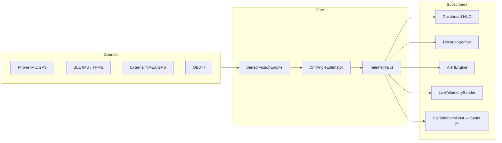

# ExpeditionGauge — Architecture & BUILD_PLAN

**Agent rule:** Execute all [AGENT] **Sequential** items first, then dispatch **Parallel** agents with isolated file scopes ([`docs/PARALLEL_AGENT_SCOPES.md`](docs/PARALLEL_AGENT_SCOPES.md)). Shared schema/types are Sequential-only.

### Parallel dispatch protocol (orchestrator)

| Step | Action |
|------|--------|
| 1 | Finish all [AGENT] **Sequential** items through the sprint **sequential_lock_step** (shared schema/types locked) |
| 2 | **Discover** parallelizable work using the decomposition checklist; add Parallel table rows with non-overlapping path scopes |
| 3 | Run `bash scripts/plan-parallel-dispatch.sh` and read **agent_count** |
| 4 | If agent_count >= 2, run `/scope` (auto Task dispatch); if 1, execute inline; if 0, run `--suggest` and expand Parallel table (or document `parallel_exception`) |
| 5 | Sequential owner merges results, runs gates, updates BUILD_PLAN (Parallel agents never edit BUILD_PLAN) |
**Decomposition checklist** (apply before finalizing Sequential items):

| Heuristic | Split into Parallel agents |
|-----------|---------------------------|
| Multi-module Android | One agent per non-overlapping package path under `examples/android/` |
| Feature container | Agent A: pure logic + unit tests; Agent B: Compose UI + i18n |
| Tests vs production | Separate `src/test/` vs `src/main/` paths when scopes do not overlap |
| Docs vs code | Agent A: app code; Agent B: `docs/features/`, ADRs |
| CI/gates vs app | Agent A: `scripts/`, `.github/workflows/`; Agent B: app tree |
**Default rule:** If a Sequential [AGENT] item touches two or more non-overlapping directory prefixes, split it — leave only schema-lock work Sequential.

**Planning (Plan Mode):** Every BUILD_PLAN proposal must include ### Parallelization with agent_count_target, decomposition table, and dry-run from `plan-parallel-dispatch.sh --suggest`. Run `check-build-plan-parallel.sh` before approval.

## Current state

- Android app under [`examples/android/`](examples/android/) (`dev.foss.expeditiongauge`) — Compose HUD, Room, BLE/GPS/OBD, playback, polish waves, v2 live telemetry.
- **Shipped:** core v1 (Sprints 0–8), polish v1.1–v1.2 (9–17b), v2 video + wizards (18), live telemetry v2.1.0 (19). Details in [`COMPLETED_TASKS.md`](COMPLETED_TASKS.md).
- **Known issue:** none on active board — Sprint 19b insets shipped pending release tag.
- **Next:** Relive wave (Sprints 22–27) complete — optional release v2.9.0 via `/ship` when ready.
- **Dev device:** OnePlus 12 · USB ADB · serial `b5214fc6` · rooted (dev only). See [`docs/DEV_DEVICE.md`](docs/DEV_DEVICE.md).

---

## Plan persistence (survives Cursor reopen / repo sync)

**Canonical source of truth (git-tracked):**

| File | Purpose |
|------|---------|
| [`BUILD_PLAN.md`](BUILD_PLAN.md) | Active sprint board — **always edit here** |
| [`project.config.json`](project.config.json) | Sprint toggles, release repo, dev device |
| [`docs/START_HERE.md`](docs/START_HERE.md) | Agent cold-start read order |
| [`.cursor/rules/expeditiongauge-plan.mdc`](.cursor/rules/expeditiongauge-plan.mdc) | Session-start rule |
**After Cursor reopen:** `pwsh scripts/expedition/resume-agent.ps1` → next `🔲 [AGENT]` row. **Never** depend on `.cursor/plans/*.plan.md`.

CI: [`.github/workflows/verify-plan.yml`](.github/workflows/verify-plan.yml) runs `verify-plan-persisted.ps1`.

---

## Automation-first: zero `[HUMAN]` rows

Every bootstrap task is **AGENT + AUTO + ADB**. Numbered BUILD_PLAN rows use `[AGENT]`, `[AUTO]`, or `[ADB]` only — no `🔲 [HUMAN]` numbered tasks. Product gates (e.g. Android Auto metric priority) use bullet notes or maintainer docs, not numbered rows.

### HUMAN → AUTO/AGENT conversion matrix

| Former HUMAN task | New owner | Script / mechanism |
|-------------------|-----------|-------------------|
| Template / clone / placeholders | AGENT + AUTO | `bootstrap.ps1`, `sync-project-config.ps1` |
| ADR approval | AUTO | `accept-adr.ps1` + `check-adr-gate.ps1` |
| Sprint / wave scope | AUTO | `project.config.json` → `sprints.*` |
| Sign-offs / releases | AUTO | `sprint-signoff.ps1`, `create-release.ps1` |
| Mark tasks done | AUTO | `mark-task.ps1` |
| **`gh auth login`** | AUTO (gate) | `ensure-gh-auth.ps1` — blocker doc only |
### Expedition script catalog

| Script | Purpose |
|--------|---------|
| `resume-agent.ps1` | Next `🔲 [AGENT]` row + session state |
| `plan-parallel-dispatch.sh` | Compute **agent_count** + write `.cursor/parallel-scope-lock.json` |
| `check-parallel-scope.sh` / `check-build-plan-parallel.sh` | Overlap + sprint Parallel table gates |
| `setup-agent-worktrees.sh` | Optional git worktree isolation from lock file |
| `dispatch-parallel-agents.ps1` | Headless CLI / SDK fallback when Task dispatch unavailable |
| `wait-parallel-agents.ps1` | Poll parallel agent completion |
| `merge-parallel-agents.ps1` | Merge parallel branches into sequential owner branch |
| `verify-plan-persisted.ps1` | CI guard — required sections + no forbidden rows |
| `sprint-signoff.ps1` | Per-sprint gates + `mark-task.ps1` |
| `check-adr-gate.ps1` | Sprint→ADR map (1→0001+0003, 5b→0007, 5c→0008, 10→0002, 15→0004, 18→0005, 19→0006, 20→0009, 21→0010, 22→0011, 25+26→0012) |
| `adb-smoke.ps1` | Device scenarios (`cold-start`, `nav-insets-*`, `live-*`, …) |
| `create-release.ps1` | `gh release create` when auth ready |
Full catalog: [`scripts/expedition/`](scripts/expedition/).

### `project.config.json` sprint toggles

| Toggle | Sprints |
|--------|---------|
| `core_v1` | 0–8 |
| `wave1_polish` / `wave2_polish` | 9–14 / 15–17 |
| `v2_video` / `v2_live_telemetry` | 18 / 19 |
| `system_ui_insets` | **19b** (on — ship before 20) |
| `v2_dual_orientation` / `v2_android_auto` | 20 / 21 |
| `v2_media_attach` … `v2_sharing_polish` | 22–27 |
### Irreducible blockers (NOT plan rows)

- **`gh auth`** — `ensure-gh-auth.ps1` exit 2
- **No ADB device** — `adb-wait-device.ps1`
- **Two-device live / long thermal** — manual; documented in COMPLETED_TASKS Sprint 19

---

## Architecture decision (ADR-0001 proposal)

**Accepted ADRs:** 0001–0008 (core + polish), 0005–0006 (v2 video + live), 0009 (orientation), 0010 (Android Auto), 0011 (media). Pending: 0012 (video pipelines).

| Layer | Choice |
|-------|--------|
| UI | Jetpack Compose + Canvas gauges; MapLibre playback map |
| State | ViewModels + DataStore; Room for sessions |
| Sensors | `TelemetryBus` / `ExpeditionGaugeServices` — single fusion pipeline |
| BLE | IMU GATT + TPMS scan + Classic SPP external GPS; `BleConnectionBudget` |
| OBD | Classic Bluetooth ELM327; tire slip ≠ drift angle β |
| Privacy | Local-only default; live telemetry opt-in P2P (Sprint 19) |
| FOSS | No Play Services / Firebase in APK; AA uses user-installed host app |
**Deep dives (do not duplicate here):**

| Topic | Doc |
|-------|-----|
| Gauge layout | [`docs/design/GAUGE_REFERENCE.md`](docs/design/GAUGE_REFERENCE.md) |
| Drift playback | [`docs/design/DRIFT_PLAYBACK.md`](docs/design/DRIFT_PLAYBACK.md) |
| Telemetry bus | [`docs/EXTENSION_POINTS.md`](docs/EXTENSION_POINTS.md) |
| Thermal | [`docs/THERMAL_PERFORMANCE.md`](docs/THERMAL_PERFORMANCE.md) |
| Live UX | [`docs/design/LIVE_TELEMETRY_UX.md`](docs/design/LIVE_TELEMETRY_UX.md) |
| Recommendations traceability | [`docs/RECOMMENDATIONS.md`](docs/RECOMMENDATIONS.md) |
| Roadmap / deferred | [`docs/ROADMAP.md`](docs/ROADMAP.md) |
| All ADRs | [`docs/adr/`](docs/adr/) |
| Feature specs | [`docs/features/`](docs/features/) |
---

## Modular telemetry pipeline (central architecture)

**Rules:** One bus; pluggable subscribers; phone-only fallback explicit; β (drift) ≠ slipRatio (tire slip).

---

## Archived sprints

| Sprint | Complete | Archive |
|--------|----------|---------|
| 0–8 | 2026-06-30 | [`COMPLETED_TASKS.md`](COMPLETED_TASKS.md) |
| 9–17b | 2026-06-30 | [`COMPLETED_TASKS.md`](COMPLETED_TASKS.md) |
| 18–19 | 2026-06-30 | [`COMPLETED_TASKS.md`](COMPLETED_TASKS.md) |
> **Sprints 0–19** — all AGENT/AUTO work archived. v2.1.0 live telemetry shipped (`versionCode` 5). Release tag deferred until `gh` auth + maintainer approval.

---

## Proposed BUILD_PLAN.md sprints

### Sprint 0 — Template Customization + Plan Materialization

> **Sprint 0** archived in [`COMPLETED_TASKS.md`](COMPLETED_TASKS.md) @ 2026-06-30.

### Sprint 1 — Foundation + ADR

> **Sprint 1** archived in [`COMPLETED_TASKS.md`](COMPLETED_TASKS.md) @ 2026-06-30.

### Sprints 2–17b — Core v1 + polish

> **Sprints 2–17b** archived in [`COMPLETED_TASKS.md`](COMPLETED_TASKS.md) @ 2026-06-30.

### Sprint 18 — Video Sync + Wizards + Enhanced Export

> **Sprint 18** archived in [`COMPLETED_TASKS.md`](COMPLETED_TASKS.md) @ 2026-06-30 (v2.0.0).

### Sprint 19 — Live Telemetry (Sender / Receiver)

> **Sprint 19** archived in [`COMPLETED_TASKS.md`](COMPLETED_TASKS.md) @ 2026-06-30 (v2.1.0). ⏸ Release tag + two-device cellular/hotspot smokes deferred.

---

## Active board — Sprint 24+

> **Sprint 19b** archived in [`COMPLETED_TASKS.md`](COMPLETED_TASKS.md) @ 2026-06-30 (v2.1.1). ⏸ Release tag deferred.
> **Sprint 20** archived in [`COMPLETED_TASKS.md`](COMPLETED_TASKS.md) @ 2026-06-30 (v2.2.0). ⏸ Release tag deferred — run `/ship` when ready.
> **Sprint 21** archived in [`COMPLETED_TASKS.md`](COMPLETED_TASKS.md) @ 2026-06-30 (v2.3.0). ⏸ DHU/head-unit ADB smokes + release tag deferred.
> **Sprint 22** archived in [`COMPLETED_TASKS.md`](COMPLETED_TASKS.md) @ 2026-06-30 (v2.4.0). ⏸ Release tag deferred.
> **Sprint 23** archived in [`COMPLETED_TASKS.md`](COMPLETED_TASKS.md) @ 2026-06-30 (v2.5.0).

### Sprint 22 — Photo & video attachment (v2.4.0)

> **Sprint 22** archived in [`COMPLETED_TASKS.md`](COMPLETED_TASKS.md) @ 2026-06-30 (v2.4.0).

### Sprint 23 — Elevation profile (v2.5.0)

> **Sprint 23** archived in [`COMPLETED_TASKS.md`](COMPLETED_TASKS.md) @ 2026-06-30 (v2.5.0).

> **Sprint 24** archived in [`COMPLETED_TASKS.md`](COMPLETED_TASKS.md) @ 2026-06-30 (v2.6.0).

> **Sprint 25** archived in [`COMPLETED_TASKS.md`](COMPLETED_TASKS.md) @ 2026-06-30 (v2.7.0).

> **Sprint 26** archived in [`COMPLETED_TASKS.md`](COMPLETED_TASKS.md) @ 2026-06-30 (v2.8.0).

> **Sprint 27** archived in [`COMPLETED_TASKS.md`](COMPLETED_TASKS.md) @ 2026-06-30 (v2.9.0).

**Relive wave order:** 22 → 23 → 24 → 25 → 26 → 27 (complete).

---

## Key file paths

| Area | Path |
|------|------|
| Entry | `examples/android/.../MainActivity.kt`, `ui/ExpeditionGaugeApp.kt` |
| Dashboard / gauges | `ui/dashboard/`, `ui/components/`, `gauge/` |
| Fusion / drift | `fusion/`, `drift/`, `slip/` |
| BLE / GPS / OBD | `ble/`, `gps/`, `obd/` |
| Recording / playback | `recording/`, `playback/`, `export/` |
| Live (shipped) | `live/`, `live-receiver/`, `signaling-server/` |
| Insets (19b) | `ui/layout/InsetAwareScaffold.kt` |
| Orientation (20) | `ui/orientation/OrientationLayoutEngine.kt` |
| Android Auto (21) | `car/` module |
| Media / flyover / share (22–27) | `media/`, `flyover/`, `share/` |
| Scripts | `scripts/expedition/*.ps1` |
---

## ADB task summary (active + reference)

| Sprint | [ADB] focus |
|--------|-------------|
| 19b | 3-button + gesture nav insets; record/scrubber visible |
| 20 | Rotate during recording; BLE/OBD persist |
| 21 | DHU/head unit live rows; record from car |
| 22 | Photo attach → scrubber marker |
| 23 | Elevation scrub sync |
| 24 | Filter + thumbnail |
| 25 | 2-min export MP4 |
| 26 | 30 s 3D flyover |
| 27 | Share card intent |
Full historical matrix: [`COMPLETED_TASKS.md`](COMPLETED_TASKS.md) + `adb-smoke.ps1` scenario list.

---

### Critique

**Strengths:** Single `TelemetryBus`; opt-in sprint toggles; inset fix before orientation unlock; Relive wave sequenced media → elevation → export → 3D.

**Top risks:** MapLibre API drift (pin version); multi-BLE OEM variance (`BleConnectionBudget`); 3D flyover thermal (WorkManager + caps); nav inset double-padding (one scaffold owner per route).

**Deferred:** Custom Canvas on Android Auto; AAOS standalone APK; real-time recording graphs; offline terrain packs.

---

## Approval gate (automated)

Bootstrap complete (2026-06-30): `BUILD_PLAN.md` at repo root, `verify-plan-persisted.ps1` green, ADR-0001/0003 accepted, `sprints.core_v1: true`.

Optional waves via **`project.config.json`** only:

- `wave1_polish` / `wave2_polish` → 9–17
- `v2_video` / `v2_live_telemetry` → 18–19 ✅
- `system_ui_insets` → **19b (active)**
- `v2_dual_orientation` → 20 · `v2_android_auto` → 21
- `v2_media_attach` … `v2_sharing_polish` → 22–27

After gates pass: Agent Mode per active sprint; `watch-agent-gates.sh` after each AGENT step; `resume-agent.ps1` after every Cursor reopen.
