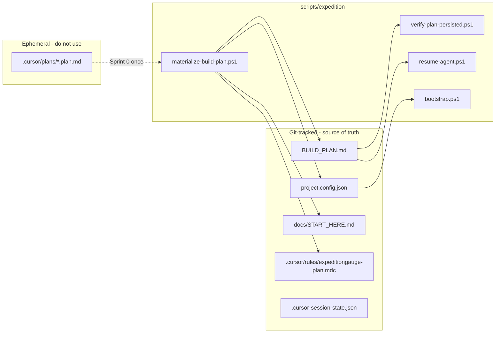
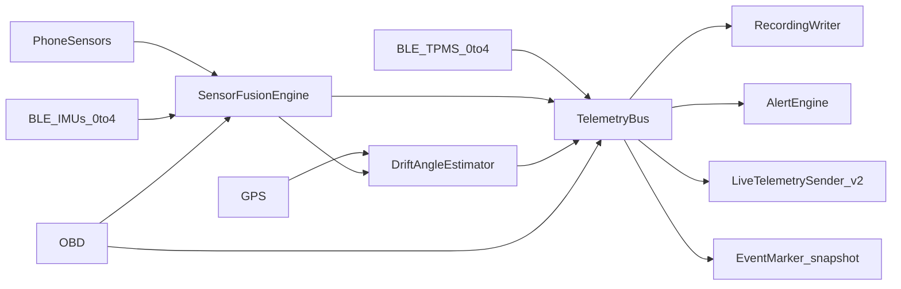
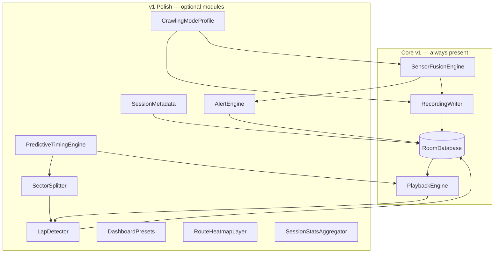
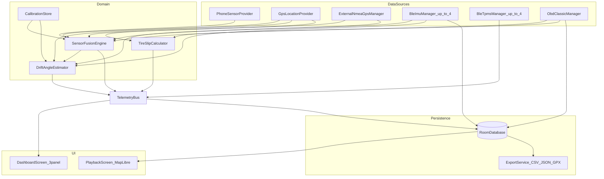
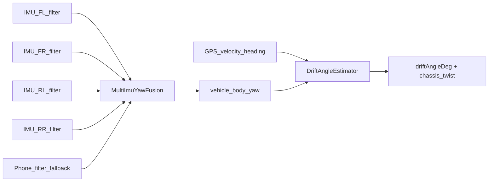

# ExpeditionGauge — Architecture & BUILD_PLAN

## Current state

- [ExpeditionGauge workspace](c:\Users\edwar\ExpeditionGauge) is **empty** — no docs, no Gradle project yet.
- Golden-path reference lives at [agent-project-bootstrap/examples/android](c:\Users\edwar\agent-project-bootstrap\examples\android): single-module Compose M3 skeleton (`dev.foss.goldenpath`), DataStore prefs, design-token theme, Robolectric unit tests, no gauges/Room/BLE/maps.
- Bootstrap process is defined in [docs/INITIALIZATION_PROMPT.md](c:\Users\edwar\agent-project-bootstrap\docs\INITIALIZATION_PROMPT.md) and [modules/android/MODULE.md](c:\Users\edwar\agent-project-bootstrap\modules\android\MODULE.md).

**Bootstrap choice (confirmed):** Create GitHub repo via **Use this template**, clone into workspace, then run `scripts/init-project.ps1 --stack android`.

### Primary dev / ADB device (confirmed)

| Property | Value |
|----------|--------|
| **Model** | OnePlus 12 |
| **Connection** | USB ADB (developer machine) |
| **Bootloader** | Unlocked |
| **Root** | Yes (rooted) |

- **Default target** for all `[ADB]` sprint tasks unless a task explicitly needs a second device (e.g. Sprint 19 Live Receiver).
- Materialize into [`docs/DEV_DEVICE.md`](docs/DEV_DEVICE.md) + `project.config.json` → `devDevice` at Sprint 0 (serial from `adb devices -l` when available).
- **Root/unlock:** dev-only convenience (thermal logcat, extended debugging, optional `adb root` workflows). **Shipped APK remains non-root** — no root requirement for end users; F-Droid target unchanged.
- **BLE stack reference device:** document OnePlus 12 multi-connection behavior (OBD + **external GPS** Classic SPP + IMU GATT + TPMS scan) in `KNOWLEDGE_BASE.md` during Sprint 4–5c ADB runs.

---

## Plan persistence (survives Cursor reopen / repo sync)

**Problem:** Plans stored only under `.cursor/plans/` are ephemeral and may not survive workspace reconnect.



**Canonical source of truth (git-tracked):**

| File | Purpose |
|------|---------|
| [`BUILD_PLAN.md`](BUILD_PLAN.md) | Full sprint board — **always edit here**, commit to git |
| [`project.config.json`](project.config.json) | Repo identity, sprint toggles, release repo, donations URL |
| [`project.config.json.example`](project.config.json.example) | Safe template for forks |
| [`docs/START_HERE.md`](docs/START_HERE.md) | Agent cold-start: read order + `resume-agent.ps1` command |
| [`.cursor/rules/expeditiongauge-plan.mdc`](.cursor/rules/expeditiongauge-plan.mdc) | `alwaysApply: true` — load plan + config every session |
| [`.cursor-session-state.json`](.cursor-session-state.json) | Optional resume checkpoint (from bootstrap `.cursor-session-state.example.json`) |

**CI guard:** [`.github/workflows/verify-plan.yml`](.github/workflows/verify-plan.yml) runs `verify-plan-persisted.ps1` on every push; wired into branch protection alongside `validate-bootstrap.sh`.

**After Cursor reopen:** `pwsh scripts/expedition/resume-agent.ps1` → grep `🔲 [AGENT]` in `BUILD_PLAN.md`. **Never** depend on `.cursor/plans/*.plan.md`.

---

## Automation-first: zero `[HUMAN]` rows

Every former bootstrap `[HUMAN]` task is replaced by **AGENT + AUTO** scripts. Sprint 0–19 BUILD_PLAN contains **zero** `🔲 [HUMAN]` rows.

### HUMAN → AUTO/AGENT conversion matrix

| Former HUMAN task | New owner | Script / mechanism |
|-------------------|-----------|-------------------|
| Click **Use this template** | AGENT | `bootstrap.ps1 -CreateRepo` — `gh repo create --template` (reads `releaseRepo` from config) |
| Clone into workspace | AGENT | Same script; idempotent skip if `.git` exists |
| Fill `INITIALIZATION_PROMPT.md` placeholders | AUTO | `sync-project-config.ps1` — reads `project.config.json` → patches placeholders + `sync-stack-config.py` |
| Fill `app-update.json` / `donations.json` | AUTO | Same script |
| Pick Cursor mode | AUTO | `resume-agent.ps1` prints Agent Mode for `[AGENT]` rows; links `docs/CURSOR_MODES.md` — not a blocking task |
| Bookmark batch commands | AUTO | [`.cursor/commands/resume.md`](.cursor/commands/resume.md) wrapping `resume-agent.ps1` |
| Approve ADR-0001 / wave ADRs | AUTO | `accept-adr.ps1 -Adr N` after AGENT drafts; `check-adr-gate.ps1 -Sprint N` blocks CI |
| Approve BUILD_PLAN sprint / wave scope | AUTO | `project.config.json` → `sprints.*` booleans; gate scripts skip disabled sections |
| Sprint sign-offs / release tags | AUTO | `sprint-signoff.ps1 -Sprint N` + `create-release.ps1` |
| Copy plan from Cursor | AGENT | `materialize-build-plan.ps1` — writes canonical files (optional `-SourcePlan` for one-time import) |
| **`gh auth login`** | AUTO (gate) | `ensure-gh-auth.ps1` — exit 0 if `gh auth status` OK or `$env:GH_TOKEN` set; exit 2 with exact command otherwise; **not** a BUILD_PLAN checkbox |
| Open repo in Cursor on new machine | AUTO (helper) | `open-in-cursor.ps1` — `cursor .` if CLI on PATH; else print clone URL |
| Mark tasks done in BUILD_PLAN | AUTO | `mark-task.ps1` — regex replace `🔲` → `✅` by sprint/step pattern |

### Expedition script catalog (Sprint 0 scaffold)

All under [`scripts/expedition/`](scripts/expedition/), wrapping bootstrap [`scripts/*.sh`](c:\Users\edwar\agent-project-bootstrap\scripts) where they exist.

| Script | Purpose |
|--------|---------|
| `materialize-build-plan.ps1` | Write `BUILD_PLAN.md`, `project.config.json`, `START_HERE.md`, cursor rule; optional `-SourcePlan` |
| `verify-plan-persisted.ps1` | Assert required sections/headers; valid `project.config.json`; fail CI if missing |
| `bootstrap.ps1` | `-CreateRepo` / `-Init`; calls `ensure-gh-auth.ps1` → `init-project.ps1 -NonInteractive` → `setup-github-repo.ps1` |
| `sync-project-config.ps1` | Config-driven placeholder + asset sync |
| `ensure-gh-auth.ps1` | Auth gate (blocker doc only if exit 2) |
| `accept-adr.ps1` | Set ADR Status Accepted + date when sections complete |
| `check-adr-gate.ps1` | Sprint→ADR map: 1→0001+0003, **5b→0007**, **5c→0008**, 10→0002, 15→0004, 18→0005, 19→0006 |
| `sprint-signoff.ps1` | Per-sprint gates + `mark-task.ps1` |
| `create-release.ps1` | `pre-release-gate.ps1` → `gh release create` (respects `-Draft` in config) |
| `mark-task.ps1` | Flip emoji markers in `BUILD_PLAN.md` |
| `resume-agent.ps1` | Print active sprint, next `🔲 [AGENT]` line; update `.cursor-session-state.json` |
| `open-in-cursor.ps1` | IDE launcher helper |
| `adb-wait-device.ps1` | Poll `adb devices` before `[ADB]` sign-offs |
| `adb-smoke.ps1` | Scenarios: `cold-start`, `calibrate-level`, `drift-simulation`, `tpms-pair`, **`external-gps`** |
| `adb-screenshot-compare.ps1` | Sprint 2: pull screenshot vs `hud-reference.png` |

**Generated `docs/START_HERE.md`:**

1. Read `BUILD_PLAN.md` and `project.config.json`
2. Run: `pwsh scripts/expedition/resume-agent.ps1`
3. Execute next `🔲 [AGENT]` row; after each step: `pwsh scripts/watch-agent-gates.ps1`
4. Blockers: see `#blockers` below (not BUILD_PLAN tasks)

**`.cursor/rules/expeditiongauge-plan.mdc`:** `alwaysApply: true`; on session start read `START_HERE.md`, `BUILD_PLAN.md`, `project.config.json`; never edit `.cursor/plans/`.

### `project.config.json` (replaces human sprint/wave decisions)

```json
{
  "projectName": "ExpeditionGauge",
  "purpose": "Offline-first automotive HUD with recording and playback",
  "stack": "android",
  "maintainer": "edward",
  "releaseRepo": "github.com/OWNER/ExpeditionGauge",
  "donationsUrl": "",
  "sprints": {
    "core_v1": true,
    "wave1_polish": true,
    "wave2_polish": true,
    "v2_video": true,
    "v2_live_telemetry": true
  },
  "features": {
    "liveTelemetryEnabled": false,
    "tpmsEnabled": false,
    "externalGpsEnabled": false
  },
  "devDevice": {
    "model": "OnePlus 12",
    "connection": "usb-adb",
    "bootloaderUnlocked": true,
    "rooted": true,
    "adbSerial": ""
  }
}
```

Gate scripts skip polish/v2 BUILD_PLAN sections when corresponding `sprints.*` is `false`.

### Irreducible blockers (NOT `[HUMAN]` plan rows)

Document in `docs/START_HERE.md` under **Blockers** — scripts exit `2`, agent halts:

1. **GitHub credentials** — run command printed by `ensure-gh-auth.ps1` once; re-run bootstrap.
2. **ADB device absent** — `[ADB]` rows blocked until `adb devices` shows hardware; use `adb-wait-device.ps1`. **Current dev machine:** OnePlus 12 connected over USB ADB (unlocked, rooted) — not a blocker for local `[ADB]` work.
3. **Product judgment** — user edits `project.config.json` in chat → AGENT commits (one file, not a sprint step).

### `[ADB]` automation

`[ADB]` stays as owner label (physical device required), but BUILD_PLAN rows invoke scripts:

- Sprint 1: `pwsh scripts/expedition/adb-smoke.ps1 -Sprint 1 -Scenario cold-start`
- Sprint 2: `pwsh scripts/expedition/adb-screenshot-compare.ps1 -Sprint 2`
- Sprint 3+: `pwsh scripts/expedition/adb-smoke.ps1 -Sprint N -Scenario <name>`

Scripts print pass/fail JSON when device connected; exit 2 gracefully when no device (documented blocker). **`adb-smoke.ps1`** may pass `-Serial` from `project.config.json` → `devDevice.adbSerial` when set.

**Default device:** OnePlus 12 (USB ADB, unlocked, rooted) — see **Current state → Primary dev / ADB device**.

---

## Architecture decision (ADR-0001 proposal)

**Pattern:** MVVM with feature packages (extends golden-path convention; no Hilt in v1 to match template simplicity).

| Layer | Package | Responsibility |
|-------|---------|----------------|
| UI | `ui/dashboard/`, `ui/playback/`, `ui/settings/`, `ui/components/` | Compose screens, Canvas gauges, MapLibre map |
| ViewModel | `ui/*/…ViewModel.kt` | Screen state, collects flows, dispatches actions |
| Domain | `fusion/`, `drift/`, `calibration/`, `slip/`, `export/`, **`live/` (v2)** | Pure Kotlin fusion + optional live encode |
| Data | `sensors/`, `gps/`, `ble/`, **`ble/tpms/`**, `obd/`, `recording/` | Android APIs, parsers, Room DAOs |
| Root | `ExpeditionGaugeApp.kt` | Manual wiring in `MainActivity` (golden-path style) |

**FOSS dependency stack (Gradle manifests only — CI FOSS grep):**

| Concern | Library | Notes |
|---------|---------|-------|
| Maps | `org.maplibre.compose:maplibre-compose` + `maplibre-compose-material3` | BSD-3; OpenFreeMap style URI |
| Storage | Room + KSP | Sessions, samples, flexible JSON column for extra metrics |
| OBD | `com.github.eltonvs:kotlin-obd-api` (JitPack) | Transport via Android Bluetooth Classic SPP |
| BLE IMU | Native `BluetoothGatt` + in-repo WitMotion parser | No proprietary Wit SDK; WIT Standard Protocol (0x61 packets) |
| **BLE TPMS** | Native BLE scan + modular `TpmsParser` (advertisement-first) | No proprietary TPMS SDK; generic valve-stem kits + brand plugins (Sprint 5b) |
| Fusion | In-repo Madgwick + complementary + lightweight EKF sideslip estimator | Apache/MIT-compatible, unit-tested; no proprietary libs |
| Async | Coroutines + Flow + `lifecycle-runtime-compose` | Already in golden path |
| **Live (v2)** | FOSS WebRTC stack (e.g. `stream-webrtc-android` or audited libwebrtc build) + OkHttp WebSocket signaling | Sprint 19 only; CI FOSS grep; no Firebase/Google WebRTC SDK |

**Non-goals for core v1 (Sprints 0–8):** Hilt, Navigation Compose, full 3D terrain, cloud sync, lap timing, ghost comparison, video sync, **live telemetry streaming**.

**Phasing model:**

| Phase | Sprints | Ship target |
|-------|---------|-------------|
| **Core v1** | 0–8 (+ **5b** TPMS, **5c** external GPS) | F-Droid-ready HUD + recording + MapLibre playback + drift viz + optional TPMS + optional external GPS |
| **v1 polish wave 1** | 9–13 | Laps, graphs, ghost, alerts, metadata, crawling |
| **v1 polish wave 2** | 15–17 | Dashboard presets, playback UX, stats, onboarding, accessibility |
| **v1.x release gates** | 14, optional 17b | Tagged releases after polish waves |
| **v2 stretch** | 18+ | Video sync, wizards, export bundles — ADR required |
| **v2 live telemetry** | **19** | **Sender/Receiver WebRTC live mode — track-day priority** |

**Modularity rule:** All polish/v2 features are **opt-in** via settings, session type, or `FeatureFlags`. Phone-only standalone mode never requires BLE, OBD, TPMS, **external GPS**, track config, presets, lap setup, **or Live Telemetry**.

**Privacy rule:** Local-only by default — no cloud sync, no analytics SDKs. **Exception (explicit opt-in):** Live Telemetry (Sprint 19) streams metrics P2P via WebRTC when the driver taps **Start Live Session**; signaling server sees only ephemeral room join metadata (session id + short code), not metric payloads. Disabled by default.

---

## Modular telemetry pipeline (central architecture)

Single read-only bus feeds recording, alerts, live streaming, and future extensions — **no duplicate sensor subscriptions**.



| Piece | Sprint | Notes |
|-------|--------|-------|
| **`TelemetryBus`** | 3 (core) | `Flow<TelemetrySnapshot>` — speed, latG, lonG, β, slip, pitch, roll, RPM, throttle, per-corner extras, **`tpms` (5b)**, **`gpsSource` + HDOP (5c)** |
| **Phone-only fusion fallback** | 3 | Madgwick + EKF sideslip — always active without external hardware |
| **`FusedGpsLocationProvider`** | **5c** | Phone GPS always on; **prefer external NMEA** when connected + valid fix; auto-fallback on disconnect |
| **Pluggable publishers** | 6+ | RecordingWriter, AlertEngine subscribe; LiveTelemetrySender plugs in Sprint 19 only when enabled |
| **Flexible schema** | 6 | Core columns + `extrasJson` for IMU/OBD/TPMS/**GPS metadata** |
| **`BleTpmsManager`** | **5b** | Advertisement-first scan; publishes to TelemetryBus only |
| **Developer / Advanced mode** | v2 (Sprint 18+) | Raw sensor tap + filter tuning UI; off by default |

**Performance budget:** `SensorPollScheduler` enforces max rates; **`ThermalMonitor`** (Sprint 3 UI, Sprint 8 docs) shows non-blocking banner: *"Phone warming up — consider external IMU or lower log rate"* when thermal threshold exceeded.

---

## Extended architecture (polish modules)

New domain modules plug into existing pipelines without replacing core fusion/recording:



| Module | Package | Integrates with |
|--------|---------|-----------------|
| `PlaybackEngine` | `playback/PlaybackEngine.kt` | Single scrubber clock drives gauges, map camera, graphs, ghost overlay |
| `LapDetector` | `timing/LapDetector.kt` | GPS line-crossing; writes `LapEntity`; works phone-only |
| `SectorSplitter` | `timing/SectorSplitter.kt` | User-defined or auto sector lines (GeoJSON); per-lap splits |
| `PredictiveTimingEngine` | `timing/PredictiveTimingEngine.kt` | Sector deltas vs session best; live HUD strip + playback panel |
| `AlertEngine` | `alerts/AlertEngine.kt` | Subscribes to `FusionSample` flow; thresholds from DataStore |
| `SessionMetadata` | `recording/SessionMetadata.kt` | Notes, vehicle config JSON on `RecordingSessionEntity` |
| `CrawlingModeProfile` | `recording/CrawlingModeProfile.kt` | Higher pitch/roll log rate; de-emphasizes speed map viz |
| `DashboardPresets` | `ui/dashboard/DashboardPreset.kt` | Drift / Offroad / Track / Minimal layout profiles |
| `RouteHeatmapLayer` | `playback/RouteHeatmapLayer.kt` | MapLibre intensity overlay for latG, β, slip |
| `SessionStatsAggregator` | `stats/SessionStatsAggregator.kt` | Cross-session aggregates (local Room queries) |
| `SettingsProfile` | `settings/SettingsProfile.kt` | Saved vehicle + sensor + viz configs (DataStore/Room) |
| `FeatureFlags` | `settings/FeatureFlags.kt` | Toggle polish modules without code paths in core HUD |

**ADR-0002 (Sprint 10):** PlaybackEngine as shared coordinator; lap/timing as pure GPS domain (no map SDK coupling).

**ADR-0003 (Sprint 3):** Drift angle = vehicle sideslip β; `DriftAngleEstimator` modular service; phone-only EKF before IMU extensions.

**ADR-0004 (Sprint 15):** Dashboard presets as declarative layout config (no duplicate ViewModels); `FeatureFlags` gates optional UI.

| `FeatureFlags` | `settings/FeatureFlags.kt` | Toggle polish modules without code paths in core HUD |
| **`LiveTelemetryModule`** | `live/` package | Optional Sender/Receiver; reads fusion bus; **off by default** |

**ADR-0006 (Sprint 19):** Live Telemetry uses WebRTC Data Channels (cellular-first); minimal FOSS WebSocket signaling for SDP/ICE exchange only; metric JSON never stored on signaling server; QR embeds session payload.

**ADR-0007 (Sprint 5b):** BLE TPMS **advertisement-first**; modular `TpmsParser`; v1 **`BrTpmsParser`** ([omadon/TPMS_BLE_BR](https://github.com/omadon/TPMS_BLE_BR)); data on `TelemetryBus` not fusion engine. See BLE TPMS section.

**ADR-0008 (Sprint 5c):** External GPS via **NMEA over Bluetooth Classic SPP** (Garmin GLO 2, Dual XGPS series). **`FusedGpsLocationProvider`** prefers external lat/lon/speed/COG when fix valid; phone GPS always running as fallback; **`DriftAngleEstimator`** uses best velocity heading for β; log `gpsSource`, HDOP, satellites. RTK / u-blox ZED-F9P → v2 polish.

**Extension points (document in `docs/EXTENSION_POINTS.md` Sprint 8):**

| Extension | Interface | Future use |
|-----------|-----------|------------|
| Fusion source | `FusionSourceProvider` | New sensor types, CAN bus adapters |
| Map overlay | `PlaybackMapLayer` | Heatmaps, custom expressions |
| Export format | `SessionExporter` | Additional formats, video burn-in |
| Alert rule | `AlertRule` | Custom compound thresholds |
| Dashboard panel | `DashboardPanel` | User-defined gauge layouts (v2+) |
| **Attitude gauge mode** | `AttitudeGaugeMode` | Attitude / G-Force / Hybrid ball mapping (Sprint 11) |
| **Live transport** | `LiveTelemetryTransport` | Alternate transports (future LAN-only UDP) |
| **TPMS parser** | `TpmsParser` | Brand-specific BLE advertisement/GATT decode (Sprint 5b+) |
| **GPS source** | `GpsSourceProvider` | Phone vs external NMEA Bluetooth GPS (Sprint 5c); RTK v2 |

---

## System data flow



---

## Multi-IMU BLE architecture

**`BleImuManager`** (singleton, `Dispatchers.IO`):

- Maintains `Map<DeviceId, ImuDeviceSession>` (max **4** concurrent GATT connections).
- Scan filter: WitMotion service UUID `0000ffe0-0000-1000-8000-00805f9b34fb` (or name prefix `WT`).
- Per session:
  - **Notify char:** `0000ffe4-0000-1000-8000-00805f9b34fb`
  - **Write char:** `0000ffe9-0000-1000-8000-00805f9b34fb`
  - **`WitMotionPacketParser`:** decode 0x61 (acc+gyro+angle), optional 0x71 register reads for quaternion/magnetometer.
  - **User label + placement:** enum `FrontLeft | FrontRight | RearLeft | RearRight | Unassigned` (DataStore-persisted).
  - **Output rate command:** register `0x03 RATE` via `FF AA 03 XX 00` (target 50–100 Hz when recording).

**`SensorFusionEngine` inputs (priority):**

1. **Pitch/Roll:** External IMU(s) if connected (vehicle-frame after placement transform); else phone Madgwick on rotation vector + linear accel.
2. **Lateral G:** Primary from best available accel (multi-IMU: weighted centroid of corner sensors); blend with GPS-derived lateral accel; yaw rate from IMU gyro-Z or GPS heading derivative.
3. **Heading / body yaw:** Compass + IMU fusion; feeds **`DriftAngleEstimator`** (Sprint 3).
4. **Multi-corner mode (Sprint 4, after single IMU):** When ≥2 IMUs labeled — per-corner lateral/longitudinal G, chassis twist, differential rear yaw for drift entry analysis.

**Single-IMU before multi (Sprint 4 order):** prove one WT901BLECL path → then enable 2–4 corner fusion. Phone-only remains default when none connected.

---

## BLE TPMS architecture (Sprint 5b — core v1)

Optional valve-stem BLE TPMS complements OBD slip, IMU G-forces, and drift angle β. **High priority for core v1** but gated by `FeatureFlags.tpmsEnabled` (default off).

### Design principles

| Principle | Detail |
|-----------|--------|
| **Advertisement-first** | Most generic valve-stem TPMS kits broadcast pressure/temp/battery in BLE manufacturer data — **no GATT connection required**, minimizing Android connection budget impact |
| **Modular parsers** | `TpmsParser` interface; **v1:** `BrTpmsParser` ("BR" valve-stem / SYTPMS-compatible); **v2:** `PechamTpmsParser`, `SysgrationTpmsParser` (PECHAM external + SYSGRATION/EKETOOL internal per [tpms-oap](https://github.com/KreAch3R/tpms-oap)) |
| **Absolute → gauge pressure** | Many "BR" sensors broadcast **absolute** pressure in manufacturer data — convert to **relative/gauge** for display (subtract ~14.5 psi / ~100 kPa at sea level; optional barometric offset in Settings v2) |
| **Corner assignment** | User maps sensor MAC → `FL \| FR \| RL \| RR` (same enum as IMU placement); auto-learn on first sight during pairing flow |
| **TelemetryBus only** | TPMS does not feed fusion engine — publishes `TpmsSnapshot` (4 corners × pressure kPa, temp °C, battery %, `lastSeenMs`) on existing bus |
| **Connection budget** | **`BleConnectionBudget`**: **1× OBD Classic SPP** + **1× external GPS Classic SPP** + up to **4 IMU GATT** + **TPMS scan-only** (no GATT) |
| **Slip correlation** | `TireSlipCalculator` + TPMS stored together in sample `extrasJson` for playback analysis (pressure drop during high \|β\| or high slipRatio) |

### Reference implementations (protocol RE — Kotlin rewrite, no vendored code)

FOSS reference repos for advertisement decoding and sensor families. ExpeditionGauge **reimplements parsers in Kotlin** under `ble/tpms/`; cite in [`docs/features/ble-tpms.md`](docs/features/ble-tpms.md) + `THIRD_PARTY_LICENSES.md` (reference only, not bundled).

| Repo | Use in ExpeditionGauge |
|------|------------------------|
| [omadon/TPMS_BLE_BR](https://github.com/omadon/TPMS_BLE_BR) | **Primary v1 target** — ESPHome BLE tracker for **"BR"** valve-stem sensors (SYTPMS-app-compatible AliExpress kits). Documents scan-only workflow, manufacturer-data layout, absolute→relative pressure. |
| [KreAch3R/tpms-oap](https://github.com/KreAch3R/tpms-oap) | **v2 parser families** — PECHAM external + SYSGRATION/EKETOOL internal sensors; corner mapping FL/FR/RL/RR; wake behavior (pressure change + ~5 min drive). |
| [andi38/TPMS](https://github.com/andi38/TPMS) | Upstream reverse-engineering (credited by both repos above). |

### "BR" sensor protocol (v1 — `BrTpmsParser`)

From [omadon/TPMS_BLE_BR](https://github.com/omadon/TPMS_BLE_BR) README (validate on OnePlus 12 during Sprint 5b ADB):

| Field | Value |
|-------|--------|
| **BLE name** | `"BR"` (scan filter prefix) |
| **Service UUID** | `0x27A5` — Bluetooth SIG *pressure (psi)* assigned number |
| **Typical MAC prefixes** | `AC:15:85:…`, `3B:60:00:…` (not exhaustive — pair by learn flow) |
| **Transport** | **Advertisement only** — manufacturer data (AD type `0xFF`); no GATT connect required |
| **Payload layout** | Length/type/value AD structures; manufacturer block encodes **battery voltage + status byte**, **temperature °C**, **absolute pressure** |
| **Pressure conversion** | Display **gauge/relative** PSI or kPa: `relative = absolute − atmospheric` (default 14.5 psi / 101.3 kPa; document in Settings) |
| **Update rate** | On pressure change + ~every few minutes idle; **wheel rotation** increases broadcast rate |

**Unit-test fixture** (from omadon example — store as `ble/tpms/fixtures/br_ad_example.hex`):

```text
RAW: 0303A527 03084252 08FF281E1401558536
  → Service 0x27A5, name "BR" (0x4252)
  → Mfg: battery ~3.0V, status 0x28, temp 20°C, absolute 34.1 psi → relative ~19.6 psi (34.1−14.5)
```

**Sprint 5b acceptance:** `BrTpmsParserTest` decodes fixture without hardware; ADB confirms live readings within ±1 psi of manual gauge after relative conversion.

### `BleTpmsManager`

- Shares **`BleScanCoordinator`** with `BleImuManager` (single scan callback, demux by name prefix `"BR"`, service UUID `0x27A5`, manufacturer ID).
- Scan filters documented in `docs/features/ble-tpms.md`; debug mode logs raw AD hex (like tpms-oap `tpms_grabber`) for adding v2 parsers.
- **`TpmsDeviceSession`**: corner label, RSSI, last reading, parser id.
- Recording start → auto-scan when TPMS enabled (Settings toggle); lightweight scan duty cycle when not recording.
- Unit tests: hex fixture packets per supported format (no hardware required).

### UI / UX (core v1)

| Surface | Behavior |
|---------|----------|
| **Recording HUD** | **Right zone (main HUD):** 4-corner tire pressure readouts in the reference photo's right circular zone — replaces compass dial. Green/yellow/red thresholds. `--` when TPMS off/disconnected (Sprint 2 placeholder → Sprint 5b live data) |
| **Heading display** | **Center zone:** large numeric heading only (e.g. `247°` / `HDG 247`) — no compass dial or needle. Wired from GPS/fusion in Sprint 3 |
| **Settings** | Enable BLE TPMS; pairing/learn flow (mirror IMU UX); per-corner assign/reassign; pressure unit PSI/kPa; temp °C/°F |
| **Alerts (Sprint 13)** | Low pressure, high temp, rapid pressure loss (ΔP/min); haptic + gauge flash; disabled by default |
| **Playback (Sprint 7 basic / 11 polish)** | Sprint 7: tire icons + last-known values in metrics panel. Sprint 11: **Tire Data** tab — pressure/temp time series synced to scrubber |
| **Live (Sprint 19)** | Include `tpms` object in downsampled JSON when Live mode active |

### v2 polish (post–core v1)

- **`PechamTpmsParser`** + **`SysgrationTpmsParser`** — internal tire-mounted sensors ([tpms-oap](https://github.com/KreAch3R/tpms-oap) families); may require GATT `service_uuid` path — use `BleConnectionBudget` on-demand
- Barometric/auto atmospheric offset for absolute-pressure sensors
- Correlation graphs: tire temp vs lateral G during drifts; pressure vs slipRatio heatmap overlay (Sprint 11 extension)
- Multi-axle / trailer TPMS slots (extend corner enum)
- **`TpmsRawCapture.kt`** (dev flag): log unknown manufacturer AD to file for community parser contributions

### Validation (no `[HUMAN]` plan row)

- **`docs/COMPATIBLE_HARDWARE.md`** — **"BR" / SYTPMS-compatible valve-stem** kits (primary v1); link [omadon/TPMS_BLE_BR](https://github.com/omadon/TPMS_BLE_BR) test model notes; PECHAM/SYSGRATION listed as v2
- Parser unit tests from `ble/tpms/fixtures/` (include omadon `br_ad_example.hex`)
- **`[ADB]`** Real-device matrix: pairing, accuracy vs gauge, simultaneous OBD Classic + 4 IMU + 4 TPMS scan — document results in `KNOWLEDGE_BASE.md`
- Missing hardware → documented **blocker** (exit 2), not a sprint checkbox

### Risks

| Risk | Mitigation |
|------|------------|
| Android BLE connection limits (OBD Classic + IMU GATT) | TPMS advertisement-first; `BleConnectionBudget`; cycle GATT TPMS only when needed |
| Brand fragmentation | Modular `TpmsParser`; **v1 = BrTpmsParser**; v2 PECHAM/SYSGRATION; raw AD capture for new brands |
| **Absolute vs gauge pressure** | Document conversion; default sea-level offset; log both in `extrasJson` debug field |
| Scan battery/heat | Scan only while recording (or user "always monitor" toggle); lower duty cycle in crawl mode |
| Stale readings | `lastSeenMs` per corner; gray icon + "signal lost" if no adv > 60 s |
| Confusion with tire **slip** | UI labels: "Tire Pressure" / "Tire Temp" — never "slip"; `slipRatio` remains OBD-derived |

---

## External Bluetooth GPS (Sprint 5c — core v1)

Optional high-sensitivity GPS receivers (Garmin GLO 2, Dual XGPS150/160/170, etc.) improve position, speed, and **velocity heading** for β and map route — especially under tree cover, canyons, and high-speed drift. Gated by `FeatureFlags.externalGpsEnabled` (default off). **Phone GPS always works alone.**

### Design principles

| Principle | Detail |
|-----------|--------|
| **NMEA over Bluetooth Classic SPP** | v1 target: paired serial-profile GPS (Garmin GLO 2, Dual XGPS). Read byte stream on `Dispatchers.IO`; no proprietary SDKs |
| **`FusedGpsLocationProvider`** | Wraps `PhoneGpsProvider` + `ExternalNmeaGpsManager`; **prefer external** when connected, fix ≥ 3D, and HDOP below threshold; **seamless fallback** to phone on disconnect/stale fix |
| **Fusion integration** | External lat/lon/speed/COG feed **`DriftAngleEstimator`** velocity heading and **`TireSlipCalculator`** GPS speed; attitude still from phone/IMU |
| **TelemetryBus** | Expose `gpsSource` (`PHONE` \| `EXTERNAL`), `hdop`, `numSatellites`, `fixQuality` on each snapshot |
| **Connection budget** | Shares **`ClassicBluetoothBudget`** with OBD — max **2 Classic SPP** (OBD + external GPS); document OnePlus 12 matrix in `KNOWLEDGE_BASE.md` |
| **Recording / playback** | Route polyline + speed + numeric HDG prefer external samples when logged; store `gpsSource` + HDOP in `extrasJson` |

### `NmeaParser` + `ExternalNmeaGpsManager`

**Package:** `gps/NmeaParser.kt`, `gps/ExternalNmeaGpsManager.kt`

| NMEA sentence | Fields used |
|---------------|-------------|
| **GGA** | Lat/lon, fix quality, satellites, HDOP, altitude |
| **RMC** | Lat/lon, speed (knots→km/h), COG, date/time, validity |
| **VTG** | Course over ground, speed (backup) |
| **GSA** | Active satellites, PDOP/HDOP/VDOP (optional) |

- Unit tests: fixture strings in `gps/fixtures/nmea_*.txt` (no hardware).
- Stale detection: no valid sentence > 2 s → fallback phone; UI gray satellite icon.
- Update rate: pass through device rate (GLO 2 up to 10 Hz); cap log rate via `SensorPollScheduler`.

### UI / UX (core v1)

| Surface | Behavior |
|---------|----------|
| **Settings** | Toggle **Use External Bluetooth GPS**; paired-device picker (Classic SPP); forget / reconnect |
| **Dashboard** | **GPS status chip** near center panel (sat count, HDOP, source EXTERNAL/PHONE); yellow icon like reference HUD |
| **Recording / playback** | Speed + numeric HDG + map route use fused external-preferential data |
| **Fallback** | Automatic; brief toast *"External GPS lost — using phone GPS"* (once per disconnect) |

### v2 polish

- RTK-capable receivers (u-blox ZED-F9P) — NMEA + optional UBX; cm-level when correction stream available
- BLE UART NMEA devices (non-Classic) via separate connector path
- Advanced fusion: weighted blend phone + external by HDOP rather than hard prefer

### Validation (no `[HUMAN]` plan row)

- **`docs/COMPATIBLE_HARDWARE.md`** — Garmin GLO 2, Dual XGPS series (primary v1 targets)
- **`[ADB]`** OnePlus 12: pair GLO 2 or Dual, compare COG/speed vs phone-only on drive loop; concurrent **OBD + external GPS + IMU + TPMS scan**
- Missing receiver → blocker exit 2 for Sprint 5c ADB only; core app unaffected

### Risks

| Risk | Mitigation |
|------|------------|
| Two Classic SPP (OBD + GPS) on some OEMs | `ClassicBluetoothBudget`; user Settings note: may need to disconnect OBD to pair GPS on problematic devices — document on OnePlus 12 |
| NMEA dialect variance | Parser tolerant of `$GN`/`$GP` prefixes; log unparsed lines in dev mode |
| Duplicate speed sources | Single `FusedGpsLocationProvider` output — OBD speed overlay unchanged (separate field) |

---

## Drift angle & multi-IMU vehicle dynamics (drifting focus)

### Terminology (logged and displayed consistently)

| Term | Meaning | ExpeditionGauge usage |
|------|---------|----------------------|
| **Tire slip angle** | Angle between tire heading and contact-patch velocity (carcass deformation) | Not directly measured in v1; approximate **rear axle contribution** via wheel speed vs GPS when OBD wheel speeds available |
| **Vehicle drift angle (sideslip β)** | Angle between vehicle longitudinal axis (fused body yaw) and **velocity vector** (GPS COG) | **Primary metric** — signed degrees: **+ = left drift**, **− = right drift** |
| **Tire slip ratio** (OBD) | `(wheelSpeed − gpsSpeed) / gpsSpeed` | Separate field `slipRatio`; used for throttle/smoothness analysis, not conflated with β |

Formula (when speed > min threshold, e.g. 5 km/h):

`driftAngleDeg = normalizeAngle(bodyYawDeg − velocityHeadingDeg)`

Route polyline follows **GPS velocity path** (actual direction of travel). Vehicle icon heading = fused body yaw; visual wedge between icon and velocity vector = β.

### Modular `DriftAngleEstimator` (Sprint 3 core, enhanced Sprint 4)

**Package:** `drift/DriftAngleEstimator.kt` — accepts `FusionInputs` from phone, 0–4 IMUs, GPS, optional OBD. Returns `DriftSample(driftAngleDeg, bodyYawDeg, velocityHeadingDeg, yawRate, confidence, source)`.

**Implementation priority:**

1. **Phone-only (Sprint 3)** — ship first, fully functional alone
2. **Single external IMU (Sprint 4 step 4)** — higher-quality body yaw
3. **Multi-IMU 2–4 corners (Sprint 4 step 5–6)** — weighted fusion + chassis twist

#### Phone-only filter stack (Sprint 3)

1. **Orientation:** Madgwick or complementary on `TYPE_ROTATION_VECTOR` + `TYPE_LINEAR_ACCELERATION` → body yaw.
2. **Sideslip EKF (lightweight error-state or complementary):**
   - **State (minimal):** `[yaw, yawRate, sideslipβ, vN, vE]` or reduced `[yaw, yawRate, β]` with GPS velocity updates.
   - **Predict:** gyro yaw-rate integration + kinematic model.
   - **Update:** GPS velocity heading (β observation), magnetometer/rotation-vector heading, lateral accel consistency.
3. **Rate:** 50 Hz default during recording; tunable process/measurement noise in Settings → Advanced (defaults sane for phone-only).
4. **Validation:** Log raw + filtered yaw/β in `extrasJson` for debug comparison.

#### Single-IMU extension (Sprint 4 — before multi)

- Per-device `ImuOrientationFilter` (Madgwick/complementary on WitMotion 0x61 angles or raw 9-axis).
- Mounting transform from corner label + user calibration offset.
- `DriftAngleEstimator` prefers external IMU yaw when connected & calibrated; GPS β update unchanged.

#### Multi-IMU fusion (Sprint 4 — after single proven)



1. **Per-IMU:** lightweight onboard filter → local yaw, linear accel, signal quality score.
2. **Multi-IMU fusion:** weighted average or simple Kalman update → vehicle body yaw; weights from calibration confidence + recent noise.
3. **4-corner extras:** rigid-body **yaw vs chassis twist/roll** (compare corner yaw deltas); per-corner lateral G for playback force vectors; noisy corner down-weighted automatically.
4. **Dropout:** if one IMU fails, others + phone compensate; phone-only path always available.

**Performance:** filters run on `Dispatchers.Default`; external IMUs reduce phone sensor load when connected.

### Playback drift visualization (Sprint 7)

**Core (v1):**

- Route = GPS velocity path (existing polyline).
- **Vehicle overlay** at scrub position: oriented arrow/icon; heading = `bodyYawDeg`; velocity vector tangent to route; **signed arc/wedge** showing β magnitude/direction.
- **Route segment coloring by β** (in addition to lonAccel): neutral yellow → high left drift cyan/blue → high right drift magenta/red (design tokens `driftLeft`, `driftRight`, `driftNeutral`).
- Icon size/opacity or tail length ∝ `abs(driftAngleDeg)` (cap for readability).
- Metrics panel: current β numeric value.

**Advanced playback toggle — "Drift Analysis View" (Sprint 7 step 5):**

- β time mini-graph (full series in Sprint 11 telemetry dock).
- Vehicle outline (rectangle/car shape) with heading vs velocity vector.
- Per-corner force/G indicators when 2–4 IMUs logged in session (`extrasJson`).
- Highlight differential rear-corner behavior during drift entry (yaw/accel delta RL vs RR).

**Sync:** all driven by `PlaybackEngine` — β, gauges, map overlay, graphs share scrubber index.

---

## Live Telemetry — Sender / Receiver mode (Sprint 19, v2 high-priority)

**Goal:** Track-day pit crew can watch driver metrics on a tablet/laptop in **< 30 seconds** with zero technical setup. Driver taps once and forgets.

**Default state:** Feature **disabled** in Settings → Advanced → Live Telemetry. No network code runs until enabled + session started.

### Roles

| Role | Device | UX |
|------|--------|-----|
| **Sender** | Driver's phone (in-car mount) | One tap **Start Live Session** → full-screen QR + 6-digit code + pulsing **LIVE** badge |
| **Receiver (web)** | Pit tablet / laptop browser | Open project web dashboard URL → scan QR or type code → gauges appear |
| **Receiver (app)** | Second Android device (optional) | In-app **Receiver** mode — same pairing flow, native Compose gauges |

### Sender flow (zero-friction)

```mermaid
sequenceDiagram
  participant Driver
  participant App as SenderApp
  participant Signal as SignalingServer
  participant Pit as ReceiverBrowser

  Driver->>App: Tap Start Live Session
  App->>Signal: Create ephemeral room (sessionId + code)
  App->>Driver: Show QR + code + LIVE indicator
  Pit->>Signal: Join room via QR/code
  Signal->>App: WebRTC offer/answer relay
  Signal->>Pit: WebRTC offer/answer relay
  App->>Pit: DataChannel JSON metrics (P2P)
  Note over App,Pit: Cellular path via STUN/TURN; LAN prefers host candidates
```

1. Driver enables Live Telemetry once in Settings (optional one-time explainer).
2. On track day: tap **Start Live Session** — no other prompts.
3. App creates ephemeral session, connects to signaling, displays **large QR** + **4–6 digit code**.
4. Reads from existing **`TelemetryBus`** (wrapper over `SensorFusionEngine` + OBD + drift outputs).
5. **`LiveTelemetryEncoder`** downsamples to ~**5–10 Hz** or **change-based** (send when speed, β, latG, RPM, throttle delta exceeds threshold).
6. Pulsing red **LIVE** strip on HUD; tap again to stop.

### QR payload (v1)

JSON URI or custom scheme, e.g. `expeditiongauge://live?v=1&...` encoded in QR:

- `sessionId` (UUID)
- `code` (6 digits, human fallback)
- `signalWss` (WebSocket signaling URL)
- `stun` / optional `turn` hints (FOSS STUN default; TURN configurable for strict NAT)

Receiver parses QR → auto-joins — no manual server entry for default config.

### Transport architecture (cellular-first)

| Priority | Path | When |
|----------|------|------|
| **1** | WebRTC **Data Channel** over **cellular** (both devices on mobile data or mixed networks) | Default track-day scenario |
| **2** | WebRTC over **shared Wi-Fi / phone hotspot** (host candidates, lower latency) | Pit on same hotspot as driver |
| **3** | (Future) LAN-only without signaling | Extension via `LiveTelemetryTransport` |

**Signaling:** Minimal FOSS **WebSocket** server (`signaling-server/` in repo — Node or Kotlin/JVM small service) relays SDP + ICE only. Deployable self-hosted; project documents optional default public instance with privacy notice. **No metric data** passes through signaling.

**NAT:** Public FOSS STUN (e.g. `stun:stun.libretransmission.org:19302` or self-hosted coturn). Optional TURN (user-provided or project FOSS coturn) for restrictive carriers — Settings → Advanced for custom ICE servers.

### Modular component design

```
live/
  LiveTelemetryModule.kt      # Feature entry; enabled flag
  TelemetryBus.kt             # Unified Flow<FusionSample> read-only tap
  LiveTelemetrySender.kt      # WebRTC PeerConnection + DataChannel
  LiveTelemetryReceiver.kt    # In-app receiver PeerConnection
  LivePairingManager.kt       # Session + QR + short code generation
  LiveSignalingClient.kt      # WebSocket join/leave, SDP exchange
  LiveTelemetryEncoder.kt     # JSON serialize + downsample
  LiveSampleDto.kt            # { t, speed, rpm, throttle, latG, beta, slip, pitch, roll, ... }
```

- **Integration:** Sender subscribes to `TelemetryBus`; does **not** fork fusion logic.
- **Recording:** Live mode orthogonal — driver can record locally while streaming.
- **Offline:** When Live off, zero network overhead; core app unchanged.

### Web receiver dashboard (`live-receiver/`)

Static **HTML + vanilla JS** (no build step required; FOSS):

- Deploy to **GitHub Pages** (`https://<org>.github.io/ExpeditionGauge/live-receiver/`)
- Mobile-friendly landscape layout: large speed, latG, β, RPM, throttle, slip, pitch/roll
- QR scanner via browser `BarcodeDetector` API with manual code fallback
- Uses browser **RTCPeerConnection** + same signaling protocol as Android
- Dark automotive theme matching app tokens (CSS variables)

### In-app Receiver mode

- Settings → Live Telemetry → **Receiver** role
- Same QR scan (CameraX) or code entry
- Reuses Sprint 2 gauge composables in read-only live mode

### Performance & thermal (Live-specific)

| Control | Value |
|---------|--------|
| Max send rate | 10 Hz hard cap |
| Change-based filter | Skip frame if no metric changed > epsilon for 200 ms |
| Payload size | Compact JSON (~200 bytes); no map/GPS trail in v1 live stream |
| CPU | Encode on `Dispatchers.Default`; WebRTC on native thread |
| Guidance | Show tip: "Live streaming increases battery use — external IMU recommended for long sessions" |

Document in `docs/THERMAL_PERFORMANCE.md` § Live Mode.

### Feature spec summary

| Aspect | Detail |
|--------|--------|
| **In core v1** | `FeatureFlags.liveTelemetryEnabled = false`; no deps |
| **In v2 (Sprint 19)** | Full Sender/Receiver + web dashboard |
| **Out of scope v1 live** | Multi-receiver fan-out, historical replay over network, cloud session storage |
| **UX success** | Driver ≤ 1 tap after enable; receiver ≤ 30 s from QR scan to live gauges |
| **Risks** | Carrier NAT → TURN config; FOSS WebRTC binary size; browser codec permissions N/A for data channel |

---

### Drift angle — integration with existing systems

| System | Integration |
|--------|-------------|
| **Room** | `SampleEntity.driftAngleDeg` first-class column; `bodyYawDeg`, `velocityHeadingDeg` optional; raw per-IMU yaw in `extrasJson` |
| **RecordingWriter** | Calls `DriftAngleEstimator.onSample()` each tick; logs confidence + source enum |
| **MapLibre** | GeoJSON segment property `driftAngle`; data expressions for line-color blend (lonAccel + β) |
| **Telemetry graphs (Sprint 11)** | β series alongside latG, slip, throttle |
| **Alerts (Sprint 13)** | Optional threshold: `maxAbsDriftAngleDeg` |
| **OBD slip (Sprint 5)** | `slipRatio` separate; rear wheel slip approx when per-wheel PIDs available — complements β, not replacement |

---

## OBD + tire slip (distinct from drift angle)

- **`ObdClassicManager`:** Bluetooth Classic SPP pairing, single adapter, `ObdDeviceConnection` from kotlin-obd-api on IO dispatcher.
- **Core PIDs (Mode 01):** `0C` RPM, `0D` speed, `11` throttle, `04` calculated load, `2F` fuel level (DTE derived), `5E` fuel rate (economy).
- **Wheel speed PIDs:** Attempt per-wheel where supported; store availability flag per session.
- **`TireSlipCalculator`:** `slipRatio = (wheelSpeed − gpsSpeed) / max(gpsSpeed, ε)` — **tire-level** longitudinal slip, not sideslip β.
- **Rear slip approximation (Sprint 5):** when rear wheel speeds + GPS available, log rear axle slip for drift throttle analysis; complements `driftAngleDeg`, does not replace it.

---

## Gauge visual reference (authoritative)

**Source:** User-provided photo of an off-road HUD inclinometer device (mounted dashboard accessory). Sprint 2 uses the reference for **palette, typography, and three-panel layout** — left zone is upgraded to a **ball-in-ring attitude G-meter** (not a literal copy of the hardware vertical bars).

**Project asset paths (created Sprint 0):**

| Asset | Path |
|-------|------|
| Reference photo | [`docs/design/gauge-reference/hud-reference.png`](docs/design/gauge-reference/hud-reference.png) |
| Written spec (for agents + reviewers) | [`docs/design/GAUGE_REFERENCE.md`](docs/design/GAUGE_REFERENCE.md) |
| F-Droid screenshot (derived later) | `examples/android/metadata/en-US/images/phoneScreenshots/1_dashboard.png` |

Sprint 0 copies the user-provided image from Cursor workspace assets into `docs/design/gauge-reference/` (convert HEIC→PNG if needed). `GAUGE_REFERENCE.md` links the photo and documents the Canvas contract below. Sprint 2 acceptance criteria reference this doc.

### Overall layout and style

- **Background:** solid black (`#000000` → design token `gauge.background`).
- **Structure:** three circular zones in a landscape `Row` — left inclinometer, center speed/GPS/**numeric heading**, right **tire pressures** (replaces reference compass dial). Each zone uses thin white arc borders (broken/dashed outer ring on center).
- **Palette:** white (scales, primary text), bright green (active/safe gauge fills), red (needles, warning segments, pointers), yellow/amber (unit labels, status icons, secondary accents).
- **Typography:** large speed uses a blocky digital/display face (7-segment-inspired, rounded); coordinates and secondary values use condensed monospace. Map to generated `Type.kt` tokens (`gaugeSpeed`, `gaugeReadout`, `gaugeLabel`).

### Left zone — ball-in-ring attitude / G-meter (v1 core)

Modern upgrade of the reference inclinometer: a **moving ball inside concentric rings** shows vehicle attitude at a glance (off-road + drifting).

- **Central display:** large circular gauge with **concentric rings** (default attitude rings at 10° / 20° / 30° pitch-roll reference); faint **crosshairs** or N/S/E/W hints for orientation.
- **Ball/dot:** smoothly animated (Compose `Animatable` or lerp on `Canvas`); position = calibrated **pitch (forward/back)** on one axis + **roll (left/right)** on the other. Sprint 2 mock motion; Sprint 3 live from `SensorFusionEngine` + `CalibrationStore`.
- **Digital readouts** below or beside ring: `Pitch: ±XX.X°` · `Roll: ±XX.X°` (yellow labels, white values — reference typography).
- **Color zones:** ring segments or ball tint — **green** (safe), **yellow** (caution), **red** (critical) from configurable thresholds (defaults in design tokens; user sliders in Settings → Gauges).
- **Calibrate / Set Level:** prominent control on this panel (required); zeros ball at level surface.
- **v1 scope:** **Attitude mode only** (pitch + roll). Optional faint **session peak-hold dot** (max tilt since record start) — Sprint 3.
- **v2 polish (Sprint 11+):** mode toggle **Attitude | G-Force | Hybrid** — G-Force maps **lateral G + longitudinal G** to ball position (rings at 0.5g / 1.0g / 1.5g); hybrid overlays both; **peak-hold trail**; tap panel → **full-screen detail** with mini graph; multi-IMU **corner force vectors** on expanded view (Sprint 7/11 tie-in).
- **Performance:** single `Canvas` per frame; respect `prefers-reduced-motion` (snap ball, disable trail).

### Center zone — speedometer & GPS

- **Speed:** very large white digital number (e.g. `35`); unit `MPH`/`km/h` in small **yellow** text beside/b above speed.
- **Numeric heading:** large white degrees (e.g. `247°`) with yellow `HDG` label — **no compass dial or needle** (replaces reference compass needle with this readout in the center zone).
- **Border:** two thin white concentric arc segments forming a broken circle frame.
- **GPS coordinates:** two lines DMS format below speed (e.g. `E 66°04'5774"`, `N 18°25'7059"`).
- **Time:** top-right of circle (e.g. `15:11`) + yellow clock icon.
- **Trip/odo:** bottom center (e.g. `0016`) + yellow terrain/hazard icon.
- **Record indicator:** red dot + Record/Stop (app addition — place bottom-left or overlay without cluttering reference layout).

### Right zone — tire pressures & status

- **Layout:** reuse reference right-zone circular frame and spacing (white arc border) — **content is tire pressure, not a compass dial**.
- **Four corners:** FL / FR / RL / RR labels with large numeric pressure (PSI or kPa per settings); optional small temp below each value when TPMS connected (Sprint 5b).
- **Color coding:** green/yellow/red per pressure thresholds; `--` when TPMS disabled or no data (Sprint 2 mock/placeholder OK).
- **Voltage / status row:** e.g. `13.7v` + yellow lightning icon (v1: show when OBD battery PID available; hide or `--` otherwise).
- **Status icons:** yellow satellite/GPS fix (top-right), yellow lamp/headlight placeholder (bottom-right) — GPS fix icon maps to real fix quality; lamp optional v1.

### Reference photo notes (intentional deviations)

| Zone | Reference hardware | ExpeditionGauge |
|------|-------------------|-----------------|
| **Left** | Vertical segmented inclinometer bars | **Ball-in-ring attitude G-meter** — same panel slot, same palette |
| **Right** | Compass dial | **Tire pressure readouts** (FL/FR/RL/RR) |
| **Center** | Speed + coords; heading implied by compass | Speed + coords + **numeric HDG °** only |

Sprint 2 ADB sign-off validates **three-panel layout, colors, and typography** — not literal replication of reference left/right gauge mechanisms.

### Canvas implementation notes

- **`AttitudeGMeterGauge`:** `Canvas` + `DrawScope` — `drawCircle` concentric rings, `drawLine` crosshairs, animated ball via `Offset` from `AttitudeBallLogic.mapPitchRoll(pitch, roll)`.
- Ring labels at 10°/20°/30° (attitude) or 0.5g/1.0g/1.5g (G-force mode v2) — `drawIntoCanvas` + `rotate` for tangential labels.
- Color zones: arc segments painted green/yellow/red from threshold radii (DataStore-backed).
- Icons: Material Icons Extended or small vector `Path` draws in yellow — no proprietary assets.
- Colors from design tokens (`gaugeGreen`, `gaugeRed`, `gaugeYellow`, `gaugeScaleWhite`, `gaugeBall`).
- Optional subtle glow on ball: `BlurMaskFilter` (accessibility: disable when reduced motion).

---

## UI layout (landscape HUD)

Three-panel `Row` matching the reference photo above. Replace golden-path home `Column` in `DashboardScreen`:

| Left | Center | Right |
|------|--------|-------|
| **Attitude G-meter** — ball-in-ring pitch/roll, digital readouts, color zones, **Calibrate / Set Level** | Speed (large digits) + **numeric heading (HDG °)** + DMS coords + time + trip | **Tire pressures** (FL/FR/RL/RR) + status icons + voltage |

- Lock landscape via `AndroidManifest` `screenOrientation="sensorLandscape"`.
- Extend [design-tokens/design-tokens.json](design-tokens/design-tokens.json) with gauge palette + typography; sync via `scripts/sync-design-tokens.py`.
- Sprint 2 **visual sign-off:** side-by-side screenshot comparison against `docs/design/gauge-reference/hud-reference.png` ([ADB] task).

---

## UX, UI & platform guidelines

**Design system (core v1 + polish):**

| Element | v1 core | v1 polish |
|---------|---------|-----------|
| Dark automotive theme | Sprint 1–2 tokens | Presets extend tokens per mode |
| Day/night brightness | Sprint 1: `BrightnessMode` (Auto / Day / Night) — screen brightness hint + higher contrast tokens for daylight | Presets inherit brightness |
| Large readable gauges | Sprint 2 **Attitude G-meter** + reference palette | Presets resize/emphasize panels |
| High-contrast mode | Sprint 17: system + in-app toggle (accessibility) | — |

**Dashboard presets (Sprint 15 — optional):**

| Preset | Layout emphasis | Recording profile |
|--------|-----------------|-------------------|
| **Default** | Balanced 3-panel HUD | `NORMAL` |
| **Drift Mode** | β readout prominent, latG, speed; compact **Attitude G-meter** or **G-Force ball** (v2) | Higher fusion rate if IMU connected |
| **Offroad / Crawling** | **Attitude G-meter dominant** (large left weight), pitch/roll alerts ready | Links to `CRAWLING` profile |
| **Track Mode** | Speed + lap timer strip (when Sprint 10 on), latG | `NORMAL` + lap config |
| **Minimal HUD** | Speed + record only; tap to expand | Low UI refresh |

- **Wireframe (landscape):** `[ Attitude G-meter | Speed / HDG / GPS | Tire Pressures ]` with preset swapping panel weights via `Row(Modifier.weight())`.
- **Quick-switch:** long-press record or toolbar chip during recording; persisted in `SettingsProfile`.

**Multi-IMU management UI (Sprint 4 enhanced):**

- Card per device: name, placement label (FL/FR/RL/RR), **signal quality bar** (RSSI + packet rate), battery if available, connect/disconnect one-tap.
- Scan sheet with sorted by signal; max 4 slots visible.
- Warning badge if placement duplicate or unassigned.

**Playback layout (Sprint 7 base, Sprint 16 polish):**

```
┌─────────────────────────────────────────────────────────────┐
│  [ Map 60% ]          │  Gauges + metrics strip              │
│  vehicle outline      │                                      │
├───────────────────────┴──────────────────────────────────────┤
│  Scrubber + event markers ●●●                                │
│  [ Graphs dock — collapsible ] (Sprint 11)                   │
└─────────────────────────────────────────────────────────────┘
```

- **Sprint 16:** `PlaybackLayoutState` — draggable split between map / gauges / graphs (landscape weights saved per profile).
- **Scrubber markers (Sprint 11):** color dots from `AlertEventEntity` + high-|β| + high-slip samples precomputed at load.
- **Keyboard/gamepad (Sprint 16):** left/right seek ±1s, space pause, `[`/`]` speed — via `onKeyEvent` when focused.

**Onboarding (Sprint 17 — basic; Sprint 18 — full wizard):**

- **v1 polish basic:** first-run 3 screens — permissions, mount phone level, first recording tip (skippable).
- **v2 full wizard:** figure-8 compass, multi-IMU corner placement with live preview.

**Recording quick-actions (Sprint 17):**

- **One-tap Mark Event** FAB (always visible while recording) — saves timestamp + **telemetry snapshot JSON** (speed, β, latG, slip, throttle, RPM, pitch, roll) to `SessionEventEntity`.
- Optional voice note: `MediaRecorder` audio snippet linked to event.
- **Optional voice command** (Sprint 17 stretch, settings off by default): "Mark event" via on-device speech recognizer — same snapshot path as FAB.
- Events appear on playback scrubber markers (Sprint 11) and in HTML summary export.
- Swipe on **Attitude G-meter** panel: toggle crawl preset (if Sprint 15 on).

**Accessibility (Sprint 17):**

- Large text: scale gauge typography via `CompositionLocal` multiplier.
- High-contrast: alternate token set (white/black, thicker strokes).
- **TalkBack:** `contentDescription` on gauges with speed, β, pitch/roll summaries.
- Optional **TTS readout** of key metrics every N seconds (settings, off by default).
- Haptic on alerts (Sprint 13).

**Live Telemetry UX (Sprint 19 — optional, off by default):**

- **Sender:** Settings → enable once → dashboard shows **Start Live Session** (large, unmissable). Active state: full-screen QR + 6-digit code + pulsing **LIVE** banner; no IP/port fields in default flow.
- **Receiver (web):** Bookmarkable URL; landing page = "Scan QR or enter code" only; auto-connect on scan.
- **Receiver (app):** Same flow with CameraX scan; reuses gauge composables read-only.
- **Wireframe (Sender active):** `[ LIVE ● ]` top strip + `[ QR 70% | Code: 482913 ]` center + `[ Stop Live ]` bottom.

**Settings profiles (Sprint 15):**

- Save/load: units, logging rate, alert thresholds, dashboard preset, BLE device bindings, viz toggles.
- Stored in Room `SettingsProfileEntity` + DataStore active profile id.
- Quick switch from Settings or pre-record dialog.

---

## Stakeholder recommendations (accepted — in scope)

The following recommendation set was reviewed and **accepted** into this BUILD_PLAN. Every item maps to an existing sprint in the **traceability matrix** below — no orphan features. Polish/v2 items remain **opt-in** via `FeatureFlags` / `project.config.json` wave toggles.

**Scope guard:** Recommendations that would duplicate core v1 (Sprints 0–8 + 5b) ship in polish waves 9–17 or v2 18–19 unless marked core above.

### Accepted — core & polish mapping (summary)

| # | Recommendation | Sprint | Notes |
|---|----------------|--------|-------|
| 1 | Event marking + telemetry snapshot | 6 stub / **17** | FAB + optional voice **note**; optional voice **command** (stretch, Sprint 17) |
| 2 | Session tags + filter | **9** | Predefined + custom tags |
| 3 | Predictive / theoretical best timing | **10** | `PredictiveTimingEngine`; default off on HUD |
| 4 | G / slip heatmap on map | **11** | `RouteHeatmapLayer` |
| 5 | Vehicle outline + drift in playback | **7** | Drift Analysis View; corner vectors with multi-IMU |
| 6 | Telemetry graph panel (collapsible) | **11** | Tap expand fullscreen (Sprint 16 layout polish) |
| 7 | Low-speed off-road / crawl mode | **9** | `CrawlingModeProfile`; attitude G-meter emphasis |
| 8 | Session comparison basics | **17** | Side-by-side stats; ghost lap stays **12** |
| 9 | HTML share summary export | **17** | `HtmlSummaryExporter` |
| 10 | One-tap Go Live + QR | **19** | Off by default |
| 11 | Driver-first recording UI | **6** | Big Stop; advanced behind sheet/cog |
| 12 | Preset modes (Drift/Offroad/Track/Minimal) | **15** | `DashboardPreset` + `SettingsProfile` |
| 13 | Calibration wizard + test drive | **17** tips / **18** full | Mount diagrams → figure-8 → multi-IMU |
| 14 | Playback session cards | **7** list / **17** polish | Map thumb, max β, peak G, Play/Compare |
| 15 | Dark theme + Bright Day Mode | **1–2** | Auto/day/night brightness tokens |
| 16 | Audio feedback (tones + TTS) | **13 / 17** | **Audible alert tones** for threshold breaches + optional TTS readout |
| 17 | Multi-IMU status indicators | **4** | Dashboard strip green/yellow/red |
| 18 | Onboarding tour | **17** | Skippable: calibrate → record → live → playback |
| 19 | Modular telemetry pipeline | **3** | `TelemetryBus` |
| 20 | Phone-only fusion fallback | **3–4** | Always-on Madgwick/EKF path |
| 21 | Performance / thermal budget | **3, 8** | `ThermalMonitor`, `SensorPollScheduler`, docs |
| 22 | Flexible data model | **6** | Room + `extrasJson` |
| 23 | Real-device ADB testing | **3–14, 19** | OnePlus 12; **drift-simulation** + long-run thermal scenarios |
| 24 | Extend new sensor types | **8** | `EXTENSION_POINTS.md` |
| 25 | Developer / Advanced mode | **18** | Raw sensors + filter tuning |
| 26 | Vehicle profiles | **15** | Street vs track setups |
| 27 | Video sync + overlay (v2) | **18** | ADR-0005 |
| 28 | **External Bluetooth GPS (NMEA)** | **5c** | Garmin GLO 2 / Dual XGPS; fused with phone GPS |

**Also in plan (beyond original list):** BLE TPMS (**5b**), Attitude G-meter (**2–3**), Live Telemetry (**19**), external GPS (**5c**).

Canonical copy for repo: materialize as [`docs/RECOMMENDATIONS.md`](docs/RECOMMENDATIONS.md) in Sprint 0 (this table + link to traceability matrix).

---

## Recommendations traceability matrix

Maps stakeholder recommendations → sprint tasks (avoids duplicate specs; gaps filled below).

### Core features

| Recommendation | Sprint | Status in plan |
|----------------|--------|----------------|
| Event marking + telemetry snapshot | **6 stub / 17** | One-tap **Mark Event** FAB + optional voice; stores snapshot JSON on `SessionEventEntity` |
| Session tags + filter/search | **9** | Tags (`Drift Session`, `Off-Road Crawl`, `Track Day`); filter on session list |
| Predictive / theoretical best timing | **10** | `PredictiveTimingEngine` live delta + sector best |
| G / slip heatmap on map | **11** | `RouteHeatmapLayer` — latG, β, slipRatio |
| Vehicle outline + drift indicator | **7** | Drift Analysis View; multi-IMU corner vectors |
| Telemetry graph panel (collapsible) | **11** | `TelemetryGraphPanel`; tap expand fullscreen |
| Low-speed off-road / crawl mode | **9** | `CrawlingModeProfile`; pitch/roll alerts via **13** |
| Session comparison summary | **17** | Pick two sessions → max G, best lap, slip events side-by-side (lightweight; ghost lap stays **12**) |
| Export HTML share summary | **17** | One-tap local HTML report (stats + sparklines) → share intent |
| Live Sender / Receiver | **19** | WebRTC + QR + web dashboard |
| **BLE TPMS (pressure + temp)** | **5b core / 11 polish / 13 alerts** | `BleTpmsManager`; tire panel; logging; alerts; playback Tire Data tab |
| **External Bluetooth GPS (NMEA)** | **5c core / v2 RTK** | `FusedGpsLocationProvider`; prefer external for route/HDG/β; phone fallback |
| **Attitude / G-meter ball-in-ring** | **2–3 core / 11 v2 / 13 alerts** | Left HUD panel; Attitude v1; G-Force + hybrid v2; peak hold |

### UX & UI

| Recommendation | Sprint | Status in plan |
|----------------|--------|----------------|
| One-tap **Go Live** + QR + connection count | **19** | Large button on recording screen; status *"Live to Pit Crew (N)"* |
| Driver-first minimal recording UI | **6** | Glanceable HUD; big Stop; advanced via cog / swipe-up sheet |
| Preset modes (Drift / Offroad / Track / Minimal) | **15** | `DashboardPreset` + links to crawl/live defaults |
| Calibration wizard + test drive | **17 basic / 18 full** | Mounting diagrams; figure-8; multi-IMU corners in v2 |
| Playback session cards (map thumb, stats, Play/Compare) | **7 list / 17 polish** | Card UI with max β, peak G, slip count |
| Dark theme + Bright Day Mode | **1–2** | Day/night/auto brightness tokens; **subtle gauge glow** on active needles/ball (accessibility-aware) |
| Haptic + **audible tones** + voice readout | **13 / 17** | Alert haptics; **SoundPool/chime** on threshold breach; optional TTS for β/latG/drift |
| Multi-IMU status indicators | **4** | Green/yellow/red per device on dashboard strip |
| **Tire status (TPMS)** | **2 layout / 5b live** | Right-zone **TirePressurePanel** on main HUD; live data Sprint 5b |
| **Attitude G-meter (ball-in-ring)** | **2–3 core / 11 v2** | Left panel; tap full-screen detail v2; color zones + calibrate prominent |
| **External GPS status** | **5c** | Satellites + HDOP chip; EXTERNAL/PHONE source indicator |
| Onboarding tour | **17** | Skippable first-run: calibrate → record → live → playback |

### Technical

| Recommendation | Sprint | Status in plan |
|----------------|--------|----------------|
| Modular telemetry pipeline | **3** | `TelemetryBus` (see above) |
| Phone-only fusion fallback | **3–4** | Core requirement |
| Performance / thermal budget | **3, 8** | `SensorPollScheduler`, `ThermalMonitor`, `THERMAL_PERFORMANCE.md` |
| Flexible data model | **6** | Core columns + `extrasJson` |
| Real-device [ADB] drift/off-road/long-run tests | **3–14, 19** | Per-sprint ADB matrix; **OnePlus 12**; `adb-smoke -Scenario drift-simulation` (high latG, β, attitude ball) |

### Future-proofing

| Recommendation | Sprint | Status in plan |
|----------------|--------|----------------|
| New sensor types via extension | **8** | `EXTENSION_POINTS.md` — `FusionSourceProvider` |
| Developer / Advanced mode | **18+** | Raw data view + filter tuning; feature flag |
| Vehicle profiles (street vs track) | **15** | `SettingsProfile` / vehicle profile entity |
| Video sync + overlay export | **18** | ADR-0005 |

---

## Performance & thermal management

Document in `docs/THERMAL_PERFORMANCE.md` (Sprint 8):

| Strategy | Implementation |
|----------|----------------|
| Adaptive poll rates | Phone-only recording: 10–20 Hz default; external IMU connected: phone sensors throttled to 5 Hz |
| **TPMS scan duty** | Scan only during recording when TPMS enabled; 1 Hz merge to TelemetryBus (hold-last-value between adv packets) |
| Fusion offload | Prefer BLE IMU yaw/accel — reduce phone Madgwick duty cycle |
| Batch Room writes | Buffer samples in memory; flush every 500 ms on IO dispatcher |
| MapLibre playback | Decimate polyline for display; full resolution for export |
| User guidance | Settings → Performance: "Use external IMU to reduce phone heat" + link to thermal doc |
| Crawl mode cap | Phone-only crawl max 15 Hz pitch/roll; 25 Hz with external IMU |

**[ADB] thermal tasks:** 20-min drift session phone-only vs single IMU — compare battery drain + skin temp proxy (logcat thermals if available).

---

## Recording schema (Room)

**Core v1 entities (Sprint 6):**

- `RecordingSessionEntity` — id, name, start/end, `recordingMode` (`NORMAL` \| `CRAWLING`), device config snapshot (IMU labels, OBD connected), **nullable** metadata columns (populated Sprint 9): `notes`, `driverName`, `conditions`, `vehicleConfigJson`.
- `SampleEntity` — timestamp, lat, lon, alt, speed, heading, pitch, roll, lonAccel, latG, yawRate, **`driftAngleDeg`**, **`bodyYawDeg`**, **`velocityHeadingDeg`**, throttle, rpm, load, **`slipRatio`** (tire slip), + `extrasJson` (per-corner IMU yaw/accel, fusion debug raw, OBD raw, **`tpms` per-corner pressureKpa/tempC/battery/lastSeenMs** — Sprint 5b).

**TPMS logging (Sprint 5b):** TPMS updates merged into each sample at RecordingWriter rate using last-known corner values (sparse source OK). Export adds optional columns `tpms_fl_kpa`, `tpms_fr_kpa`, `tpms_rl_kpa`, `tpms_rr_kpa`, `tpms_*_temp_c` or nested JSON block.

**GPS logging (Sprint 5c):** `extrasJson` includes `gpsSource`, `hdop`, `numSatellites`, optional parallel phone GPS debug fields when Developer mode on.

**Schema hooks (Sprint 6 — nullable / empty tables OK):** create tables in v1 migration so polish sprints avoid breaking migrations; UI hidden until feature enabled.

| Entity | Sprint | Purpose |
|--------|--------|---------|
| `TrackConfigEntity` | 6 (stub) / 10 (use) | Start/finish line + sector lines as GeoJSON per session or saved track |
| `LapEntity` | 6 (stub) / 10 (use) | lapNumber, start/end sample IDs, durationMs, isValid, isOutLap |
| `SectorSplitEntity` | 6 (stub) / 10 (use) | lapId, sectorIndex, splitMs, sampleId at crossing |
| `AlertEventEntity` | 6 (stub) / 13 (use) | timestamp, alertType, value, threshold, acknowledged |
| `SessionEventEntity` | 6 (stub) / 17 (use) | User marks, **telemetrySnapshotJson**, voice note URI, tag |
| `SettingsProfileEntity` | 6 (stub) / 15 (use) | Saved vehicle + viz + sensor config JSON |

**Export (core v1):** CSV (flat), JSON (nested), GPX (track + extensions for metrics). Lap/sector columns appended in polish exports (Sprint 10+).

---

## Playback + MapLibre visualization

- **`PlaybackEngine` (Sprint 7):** owns scrubber position, playback speed, current `SampleEntity`, emits `PlaybackState` Flow consumed by gauges, map, and (Sprint 11) graphs. Single source of truth prevents desync.
- **`PlaybackScreen`:** timeline scrubber, speed multiplier, live gauge replay.
- **MapLibre Compose:**
  - GeoJSON `LineString` source with per-segment properties: `lonAccel`, `latG`, **`driftAngle`**, `slipRatio`, `throttle`.
  - **Line color expression:** green (accel) → yellow (neutral) → red (brake) from `lonAccel`; **blend or alternate mode** with β gradient (yellow neutral → cyan/blue left → magenta/red right).
  - **Line width / offset bands:** data-driven from `abs(latG)` + direction; widen under high lateral load.
  - **Tire slip overlay:** color modulation when `slipRatio` exceeds threshold (distinct from β coloring).
  - **Vehicle drift overlay:** oriented arrow/icon at scrub position; heading = body yaw; arc/wedge = signed β; tail/opacity ∝ magnitude.
  - **Elevation profile:** Compose `Canvas` chart below map (v1 — not full hillshade).
  - **Camera:** `rememberCameraState()` + `animateTo()` following scrub position.
- **Drift Analysis View toggle:** vehicle outline, heading vs velocity vector, per-corner force vectors (multi-IMU sessions), β numeric + sparkline.
- **Polish extensions (Sprints 11–12):** driving-line overlay layer, sector boundary markers, ghost lap semi-transparent route (see feature specs below).

---

## Nice-to-have feature specs (v1 polish)

Each feature is **optional**, **local-only**, and **non-breaking** for phone-only users who never open timing/playback extras.

### 1. Lap / sector timing + predictive timing — Sprint 10

| Aspect | Detail |
|--------|--------|
| **In core v1** | Nothing (schema stubs only) |
| **In v1 polish** | GPS auto lap detection, manual start/finish line placement, up to 9 sectors, sector splits, session best lap, theoretical best (sum of best sectors), predictive delta display |
| **Out of scope** | Transponder timing, external beacon hardware, multi-car timing |
| **Integration** | `LapDetector` reads GPS samples from `RecordingWriter` live + replay; crossing uses start/finish `LineSegment` in `TrackConfigEntity`; `PredictiveTimingEngine` compares elapsed sector time vs best split; playback highlights current sector on map |
| **UI/UX** | Dashboard: compact lap timer + predictive delta strip (toggle in settings). Playback: lap list sidebar, sector times table, best-lap ghost toggle. Track setup: map tap to place start/finish + sector lines (reuse MapLibre in edit mode) |
| **Phone-only** | Fully functional — GPS only; no OBD/IMU required |
| **Risks** | GPS jitter at low speed → min speed threshold for crossing; out-lap detection heuristic; indoor/no-GPS sessions skip lap features gracefully |

### 2. Telemetry graphs in playback — Sprint 11

| Aspect | Detail |
|--------|--------|
| **In core v1** | Metrics panel (numeric) only in Sprint 7 |
| **In v1 polish** | Scrollable time-series graphs: speed, lon/lat G, **driftAngleDeg**, throttle %, RPM, **slipRatio**, pitch, roll, **per-corner tire pressure + temp (TPMS)** — synced to scrubber; optional **temp vs latG** correlation view (v2 polish) |
| **Out of scope** | Real-time graphs during recording (v2 consideration); export graph as image |
| **Integration** | `PlaybackEngine.currentSampleIndex` drives graph cursor; downsample for display (>10k points); missing channels (no OBD) hide series |
| **UI/UX** | Collapsible graph dock below map (landscape); tap series legend to toggle; double-tap graph to seek scrubber |
| **Phone-only** | All phone-fusion channels available; OBD/RPM series hidden when absent |
| **Risks** | Performance on long sessions → decimate + windowed load from Room |

### 3. Enhanced driving line / path analysis — Sprint 12 (partial Sprint 7 base)

| Aspect | Detail |
|--------|--------|
| **In core v1** | Colored polyline + latG width bands + slip modulation (Sprint 7) |
| **In v1 polish** | Dedicated **Driving Line** map mode: racing line emphasis, apex markers from latG peaks, braking zone highlights (lonAccel < threshold), optional parallel offset lines for entry/exit |
| **Out of scope** | AI-optimal line suggestion, track map import |
| **Integration** | Additional MapLibre layers sourced from same GeoJSON; expressions add `line-offset` bands from latG direction; apex points = local max `abs(latG)` per lap segment |
| **UI/UX** | Playback toolbar toggle: `Route` \| `DrivingLine` \| `Both`; sector boundaries overlaid when laps enabled |
| **Phone-only** | Uses logged GPS + fusion data only |
| **Risks** | MapLibre expression complexity — fallback to precomputed segment properties in Kotlin if runtime expressions lag |

### 4. Lap / run comparison (ghost lap) — Sprint 12

| Aspect | Detail |
|--------|--------|
| **In core v1** | None |
| **In v1 polish** | Compare two laps from same or different sessions; ghost route overlay; delta-time at scrubber position; optional side-by-side sector table |
| **Out of scope** | Simultaneous dual-video sync (v2) |
| **Integration** | `PlaybackEngine` loads primary + ghost sample streams; time-align by distance-along-track or sector-normalized time; ghost layer = second GeoJSON source with reduced opacity |
| **UI/UX** | Lap picker → "Set as ghost"; delta shown as `+0.42s` floating near speed gauge during playback |
| **Phone-only** | Yes |
| **Risks** | Different track layouts between sessions → warn user, disable compare if start/finish mismatch |

### 5. Configurable alerts / thresholds — Sprint 13

| Aspect | Detail |
|--------|--------|
| **In core v1** | None |
| **In v1 polish** | User-defined thresholds: max latG, maxAbsDriftAngleDeg, max slipRatio, max pitch/roll, over-rev (RPM), speed, **low fuel economy** (OBD fuel rate), **low tire pressure**, **high tire temp**, **rapid pressure loss** (TPMS — Sprint 5b data required); live **haptic + audible tone** + gauge flash + post-session review |
| **Out of scope** | Push notifications, SMS, cloud alerts |
| **Integration** | `AlertEngine` observes fusion flow; thresholds in DataStore; writes `AlertEventEntity` during recording; playback graph shows alert markers |
| **UI/UX** | Settings → Alerts: per-metric slider + enable toggle. Dashboard: brief red flash on gauge zone (no modal). Playback: alert chips on scrubber |
| **Phone-only** | latG/pitch/roll/speed alerts work; RPM/slip alerts enabled only when OBD connected; **TPMS alerts when TPMS enabled + corner mapped** |
| **Risks** | Alert spam → cooldown per alert type (e.g. 3s); disabled by default |

### 6. Per-session notes & vehicle setup — Sprint 9

| Aspect | Detail |
|--------|--------|
| **In core v1** | Nullable DB columns; no UI |
| **In v1 polish** | Notes, driver, conditions, tire pressure, suspension, vehicle name, **tags**, **camera photo attachment** (local URI); search by tag/note |
| **Out of scope** | Structured OEM setup sheets |
| **Integration** | Room fields + JSON blob for extensible key-value; included in JSON export |
| **UI/UX** | Session list → edit metadata; optional pre-record dialog (skippable); search sessions by note text (local) |
| **Phone-only** | Yes — pure metadata |
| **Risks** | None significant |

### 7. Low-speed / crawling mode — Sprint 9

| Aspect | Detail |
|--------|--------|
| **In core v1** | `RecordingMode.NORMAL` only in UI |
| **In v1 polish** | `RecordingMode.CRAWLING`: higher sample rate for pitch/roll (e.g. 20 Hz), dashboard emphasizes **Attitude G-meter** panel, map de-emphasized or hidden during record, lower GPS speed filter noise |
| **Out of scope** | Separate off-road map layers, rock-crawl trail database |
| **Integration** | `CrawlingModeProfile` adjusts `RecordingWriter` sample priorities + fusion smoothing ( heavier complementary filter on roll/pitch ); playback defaults to inclinometer + pitch/roll graph |
| **UI/UX** | Record button long-press or settings toggle for mode; yellow "CRAWL" badge on HUD |
| **Phone-only** | Primary use case for off-road without external IMU; external IMU still enhances if connected |
| **Risks** | Battery/heat at high log rate → cap crawl rate on phone-only vs external IMU; see `docs/THERMAL_PERFORMANCE.md` |

### 8. Heatmap route overlays — Sprint 11

| Aspect | Detail |
|--------|--------|
| **In core v1** | Segment color from lonAccel + β (Sprint 7) |
| **In v1 polish** | Toggle **heatmap mode**: intensity along route for `abs(latG)`, `abs(driftAngleDeg)`, or `slipRatio` — MapLibre `line-gradient` or precomputed heat property |
| **Integration** | `playback/RouteHeatmapLayer.kt`; metric selector in playback toolbar; same GeoJSON source |
| **UI/UX** | Legend bar (low→high); does not replace velocity-path polyline |
| **Phone-only** | Yes — uses logged fusion fields |
| **Risks** | GPU load — allow disable; fallback to discrete color buckets computed in Kotlin |

### 9. Dashboard presets + settings profiles — Sprint 15

| Aspect | Detail |
|--------|--------|
| **In core v1** | Single default layout |
| **In v1 polish** | Drift / Offroad / Track / Minimal presets; saved profiles; quick-switch during recording |
| **Integration** | `DashboardPreset` data class drives composable weights; links to `RecordingMode` + `FeatureFlags` |
| **UI/UX** | Settings → Profiles; chips on dashboard top bar |
| **Phone-only** | All presets work without hardware |
| **Risks** | Layout explosion — max 5 presets v1; declarative config only |

### 10. Enhanced playback scrubber + split panels — Sprint 11 (markers), Sprint 16 (layout)

| Aspect | Detail |
|--------|--------|
| **In core v1** | Basic scrubber (Sprint 7) |
| **In v1 polish** | Event markers (alerts, high-β, high-slip); keyboard/gamepad seek; resizable map/graph/gauge panels |
| **Integration** | `PlaybackEngine` exposes marker indices; `PlaybackLayoutState` in DataStore |
| **UI/UX** | Landscape-optimized; remember layout per profile |
| **Risks** | Compose drag-split complexity — use fixed 2–3 weight presets if drag too costly |

### 11. Session stats dashboard — Sprint 17

| Aspect | Detail |
|--------|--------|
| **In core v1** | Session list only |
| **In v1 polish** | Home/stats screen: best lap, max |β|, max latG, slip event count, total distance, session count — local Room aggregates |
| **Out of scope** | Cloud leaderboards, social compare |
| **Integration** | `stats/SessionStatsAggregator.kt`; optional Room views or runtime queries |
| **UI/UX** | Card grid on session list header; tap for detail |
| **Depends on** | Laps (10), alerts (13) for full stats; partial without |

### 12. Recording event markers + voice notes — Sprint 17

| Aspect | Detail |
|--------|--------|
| **In v1 polish** | Double-tap mark event; optional short voice note; shows on scrubber + export JSON |
| **Integration** | `SessionEventEntity` (sessionId, timestamp, type, tag, **telemetrySnapshotJson**, audioUri?) |
| **Phone-only** | Yes |
| **Out of scope** | Continuous voice logging |

### 13. Accessibility pack — Sprint 17

| Aspect | Detail |
|--------|--------|
| **In v1 polish** | Large text multiplier, high-contrast tokens, TalkBack labels, optional TTS metric readout, alert haptics (with Sprint 13) |
| **Integration** | `ui/theme/AccessibilityPreferences.kt`; wraps gauge typography |
| **Phone-only** | Yes |

### 14. BLE TPMS (valve-stem pressure + temperature) — Sprint 5b / 11 / 13 / 19

| Aspect | Detail |
|--------|--------|
| **In core v1** | Full TPMS path in **Sprint 5b**: scan, parse, tire panel, TelemetryBus, Room logging, export columns |
| **In v1 polish** | Sprint 11 Tire Data graphs; Sprint 13 pressure/temp/rapid-loss alerts; temp vs latG correlation (v2 polish) |
| **In v2** | Sprint 19 live stream includes `tpms`; extra brand parsers; internal tire-mounted sensors if feasible |
| **Out of scope** | Cloud tire monitoring services; TPMS firmware updates |
| **Integration** | `BleTpmsManager` → `TelemetryBus` → `RecordingWriter` / `AlertEngine` / `LiveTelemetryEncoder`; **`BrTpmsParser`** v1; correlates with `slipRatio` in `extrasJson` |
| **Protocol refs** | [omadon/TPMS_BLE_BR](https://github.com/omadon/TPMS_BLE_BR), [KreAch3R/tpms-oap](https://github.com/KreAch3R/tpms-oap), [andi38/TPMS](https://github.com/andi38/TPMS) |
| **UI/UX** | Right-zone tire pressures on main HUD; Settings pairing; playback Tire Data tab; alerts haptic + flash; center-zone numeric HDG |
| **Phone-only** | TPMS entirely optional — no impact when disabled |
| **Validation** | Parser fixtures + `docs/COMPATIBLE_HARDWARE.md`; `[ADB]` with physical sensors (blocker if absent, not `[HUMAN]` row) |
| **Risks** | BLE connection budget — advertisement-first; see ADR-0007 |

### 15. Attitude / G-meter ball-in-ring — Sprint 2 / 3 / 11 / 13

| Aspect | Detail |
|--------|--------|
| **In core v1** | **Sprint 2–3:** `AttitudeGMeterGauge` — ball-in-ring, Pitch/Roll digital readouts, color zones (green/yellow/red), **Calibrate / Set Level**, live fusion data, session peak-hold dot |
| **In v1 polish** | **Sprint 11:** Attitude playback tab; **G-Force \| Hybrid** mode toggle; peak-hold trail; tap → full-screen detail. **Sprint 13:** pitch/roll threshold alerts drive ball/ring color + haptic |
| **In v2** | Expanded view with multi-IMU corner force vectors (ties to Sprint 7 Drift Analysis); ring sensitivity presets in Settings |
| **Out of scope** | 3D vehicle mesh; artificial horizon aviation instrument clone |
| **Integration** | `SensorFusionEngine` pitch/roll + `CalibrationStore` → `AttitudeBallLogic` → `AttitudeGMeterGauge`; latG/lonG → `GForceBallLogic` (v2); `AlertEngine` + `TelemetryBus`; peaks logged in session metadata |
| **UI/UX** | Left panel in three-panel HUD; landscape + day/night tokens; Settings → Gauges: ring markings (10°/20°/30°), zone thresholds, mode toggle (v2) |
| **Phone-only** | Fully functional from phone IMU — primary off-road use case |
| **Validation** | Unit tests for ball mapping; `[ADB]` calibrate + tilt + high-G drift/off-road simulation; **`adb-screenshot-compare.ps1`** for layout (not `[HUMAN]` design review row) |
| **Risks** | Canvas perf on low-end devices — profile on `[ADB]`; calibration UX must stay one-tap prominent |

### 16. External Bluetooth GPS (NMEA) — Sprint 5c / v2 RTK

| Aspect | Detail |
|--------|--------|
| **In core v1** | **Sprint 5c:** `NmeaParser`, `ExternalNmeaGpsManager`, **`FusedGpsLocationProvider`**; Garmin GLO 2 / Dual XGPS via Classic SPP; prefer external for route, speed, HDG, β velocity heading |
| **In v2 polish** | RTK (u-blox ZED-F9P); BLE UART NMEA; HDOP-weighted blend |
| **Out of scope** | Proprietary Garmin/Dual SDKs; cloud RTK subscription services |
| **Integration** | Feeds `DriftAngleEstimator`, map polyline, center speed/HDG; phone GPS always fallback; `gpsSource` + HDOP in logs |
| **UI/UX** | Settings toggle + device picker; GPS status chip (sats, HDOP, EXTERNAL/PHONE) |
| **Phone-only** | Fully functional — external always optional |
| **Validation** | NMEA fixtures; `[ADB]` drive loop vs phone GPS; full stack OBD+GPS+IMU+TPMS on OnePlus 12 |
| **Risks** | Two Classic SPP slots — see `ClassicBluetoothBudget`; document OEM quirks |

### 17. Live Telemetry (Sender / Receiver) — Sprint 19

| Aspect | Detail |
|--------|--------|
| **In core v1** | `FeatureFlags.liveTelemetryEnabled = false`; `TelemetryBus` interface stub optional in Sprint 8 |
| **In v2 (Sprint 19)** | WebRTC Data Channel streaming; QR + 6-digit code; web + in-app Receiver |
| **Integration** | Reads `TelemetryBus` (fusion + OBD + drift); independent of Room recording |
| **UI/UX** | Sender: one button → QR; Receiver: scan/type code → gauges in < 30 s |
| **Phone-only** | Streams all phone-fusion metrics; OBD fields null when disconnected |

### 14–16. Other v2 items — Sprint 18

See **v2 stretch** section below for video sync, full multi-IMU calibration wizard, enhanced export bundles (GPX extensions, CSV wide, video+data zip).

---

## v2 stretch — Sprint 18+ (ADR-0005 required)

No tasks until v1.x stable. Track in `docs/ROADMAP.md`.

| Feature | Scope | Integration |
|---------|-------|-------------|
| **Video sync + data overlay** | In-app camera record OR import MP4; align by start timestamp + manual offset nudge; export burn-in via MediaCodec + Canvas overlay (FOSS) | `video/VideoSyncEngine.kt`, links to `PlaybackEngine` |
| **Full guided calibration wizard** | Phone mount, figure-8 compass, per-corner IMU verify with live vectors | Extends `calibration/` + BLE UI |
| **Enhanced exports** | GPX custom extensions (β, laps, alerts); CSV wide format; JSON nested; optional zip bundle (session + video + overlay MP4) | `export/EnhancedExportService.kt` |
| **Live Telemetry** | See Sprint 19 — WebRTC Sender/Receiver (track-day priority) | `live/` package |
| **Real-time recording graphs** | Live mini graphs on dashboard | v2 — high CPU risk |

**Partial v1 overlap:** Basic onboarding (Sprint 17), photo attach (Sprint 9), stats dashboard (Sprint 17) ship before full v2 video/export.

**ADR trigger:** Sprint 18 — **`check-adr-gate.ps1 -Adr 0005`** (AUTO in CI).

---

## Proposed BUILD_PLAN.md sprints

Copy [BUILD_PLAN.md Child Repo Playbook](c:\Users\edwar\agent-project-bootstrap\BUILD_PLAN.md) as base, then replace Sprint 2+ with:

### Sprint 0 — Template Customization + Plan Materialization

**Sequential:**

1. 🔲 [AGENT] **`scripts/expedition/materialize-build-plan.ps1`** — write canonical [`BUILD_PLAN.md`](BUILD_PLAN.md) + [`project.config.json`](project.config.json) + [`docs/START_HERE.md`](docs/START_HERE.md) + [`docs/DEV_DEVICE.md`](docs/DEV_DEVICE.md) + [`docs/RECOMMENDATIONS.md`](docs/RECOMMENDATIONS.md) (accepted stakeholder list) + [`.cursor/rules/expeditiongauge-plan.mdc`](.cursor/rules/expeditiongauge-plan.mdc); **commit immediately**
2. 🔲 [AGENT] **`scripts/expedition/bootstrap.ps1 -Init`** (or `-CreateRepo` when `ensure-gh-auth.ps1` passes) — `init-project.ps1 -Stack android -ProjectName ExpeditionGauge -Prune -NonInteractive` → `setup-github-repo.ps1`
3. 🔲 [AGENT] **`scripts/expedition/sync-project-config.ps1`** — sync assets, INITIALIZATION_PROMPT placeholders, donations
4. 🔲 [AGENT] Rename package `dev.foss.goldenpath` → `dev.foss.expeditiongauge`; gauge reference assets (`docs/design/gauge-reference/hud-reference.png`, `GAUGE_REFERENCE.md`)
5. 🔲 [AGENT] Scaffold all **`scripts/expedition/*.ps1`** + [`.github/workflows/verify-plan.yml`](.github/workflows/verify-plan.yml)
6. 🔲 [AUTO] **`ensure-gh-auth.ps1`** inside bootstrap (blocker doc only if exit 2 — not a BUILD_PLAN row)
7. 🔲 [AUTO] **`scripts/expedition/sprint-signoff.ps1 -Sprint 0`** — validate-bootstrap, feature-gate, verify-plan-persisted, FOSS grep

### Sprint 1 — Foundation + ADR

**Sequential:**

1. 🔲 [AGENT] Draft ADR-0001, ADR-0003 (bundled); **`accept-adr.ps1 -Adr 0001,0003`**
2. 🔲 [AUTO] **`check-adr-gate.ps1 -Sprint 1`** before implementation tasks
3. 🔲 [AGENT] Automotive dark design tokens + day/night brightness + landscape shell
4. 🔲 [AGENT] Room + MapLibre + kotlin-obd-api dependencies (pinned, lockfile)
5. 🔲 [ADB] `pwsh scripts/expedition/adb-wait-device.ps1` then `adb-smoke.ps1 -Sprint 1 -Scenario cold-start`

### Sprint 2 — Gauges + Calibration (match reference HUD)

**Sequential:**

1. 🔲 [AGENT] `docs/features/gauges.md` — acceptance criteria **must cite** [`docs/design/GAUGE_REFERENCE.md`](docs/design/GAUGE_REFERENCE.md)
2. 🔲 [AGENT] Extend design tokens: gauge colors + display typography; sync to `Color.kt` / `Type.kt`
3. 🔲 [AGENT] `gauge/GaugeLogic.kt` + **`gauge/AttitudeBallLogic.kt`** (pitch/roll → ball `Offset`, ring clamping, color zone radii) + unit tests; **`gauge/GForceBallLogic.kt`** stub for v2
4. 🔲 [AGENT] Canvas composables (reference palette + intentional zone deviations):
   - **`AttitudeGMeterGauge.kt`** — ball-in-ring, concentric rings, crosshairs, animated ball, Pitch/Roll digital readouts, green/yellow/red zones; **Attitude mode** (v1)
   - `SpeedometerGauge` — broken white ring, large digital speed, yellow unit label
   - **`HeadingReadout.kt`** — numeric heading only (e.g. `247°`, yellow `HDG` label)
   - **`TirePressurePanel.kt`** — right-zone frame; FL/FR/RL/RR; `--` placeholder until Sprint 5b
   - `StatusIcons` — yellow GPS-fix, clock, trip, voltage icons
5. 🔲 [AGENT] `calibration/CalibrationStore.kt` + prominent **Calibrate / Set Level** on attitude panel; document in `GAUGE_REFERENCE.md`
6. 🔲 [AGENT] Wire dashboard ViewModel with mock pitch/roll animating ball + placeholder heading/tire data; composition root ≤10 lines
7. 🔲 [ADB] `adb-screenshot-compare.ps1 -Sprint 2` — three-panel layout/palette (ball-in-ring left, not reference vertical bars)
8. 🔲 [ADB] `adb-smoke.ps1 -Sprint 2 -Scenario calibrate-level` — calibrate zeros ball; tilt moves ball smoothly within rings

**Parallel (after step 4):**

| Task | Owner | Scope |
|------|-------|-------|
| Attitude G-meter + tests | AGENT | **`AttitudeGMeterGauge.kt`**, **`AttitudeBallLogic.kt`**, unit tests |
| Speed + center panel | AGENT | `SpeedometerGauge.kt`, `GpsReadoutPanel.kt`, **`HeadingReadout.kt`** |
| Tire pressures + status | AGENT | **`TirePressurePanel.kt`**, `StatusIcons.kt` |

### Sprint 3 — Phone Sensors + GPS + Fusion + Drift Angle (phone-only first)

**Sequential:**

1. 🔲 [AGENT] `docs/features/sensor-fusion.md` + `docs/features/drift-angle.md` (terminology: β vs tire slip)
2. 🔲 [AGENT] `PhoneSensorProvider`, **`gps/PhoneGpsProvider.kt`** (Sprint 3); refactor to **`FusedGpsLocationProvider`** in Sprint 5c
3. 🔲 [AGENT] `fusion/MadgwickFilter.kt`, `fusion/ComplementaryFilter.kt`, `fusion/SensorFusionEngine.kt` + unit tests
4. 🔲 [AGENT] **`drift/DriftAngleEstimator.kt`** + `drift/SideslipEkf.kt` (or complementary sideslip): phone-only path; state `[yaw, yawRate, β]`; GPS velocity heading updates
5. 🔲 [AGENT] Lateral G + heading; optional live β readout on dashboard (compact, settings toggle)
6. 🔲 [AGENT] **`TelemetryBus.kt`** — unified `Flow<TelemetrySnapshot>` for recording/alerts/live (Sprint 19)
7. 🔲 [AGENT] **`ThermalMonitor.kt`** — non-blocking banner when device thermal throttling detected
8. 🔲 [AGENT] Wire live data to gauges: **Attitude G-meter** from fusion pitch/roll + calibration; DMS, altitude, clock; numeric HDG in center
9. 🔲 [AGENT] **Session peak-hold** on attitude gauge (max \|pitch\|, \|roll\| since record start) — store peaks in session metadata / `extrasJson`
10. 🔲 [AGENT] Unit tests: known yaw + velocity heading → expected β; attitude ball mapping fixtures; low-speed β suppressed below threshold
11. 🔲 [AGENT] **`SensorPollScheduler`**: adaptive rates documented; phone-only defaults per `THERMAL_PERFORMANCE.md`
12. 🔲 [ADB] **Phone-only:** **ball tracks pitch/roll**, speed, numeric HDG, lateral G, **β plausible in turns**
13. 🔲 [ADB] 10-min recording thermal/CPU baseline + thermal banner smoke test

### Sprint 4 — External BLE IMU (single first, then multi)

**Sequential:**

1. 🔲 [AGENT] `docs/features/ble-imu.md`; `ble/WitMotionPacketParser.kt` + parser unit tests (0x61 fixtures)
2. 🔲 [AGENT] **`ble/BleScanCoordinator.kt`** + **`ble/BleConnectionBudget.kt`** + **`ble/ClassicBluetoothBudget.kt`** (max 2 Classic SPP: OBD + external GPS) — shared scan demux for IMU + TPMS (Sprint 5b/5c)
3. 🔲 [AGENT] `ble/BleImuManager.kt` + `ble/ImuDeviceSession.kt` (max 4 connections, reconnect)
3. 🔲 [AGENT] Settings UI: scan, connect, **per-device signal quality (green/yellow/red)**, one-tap disconnect, label placement (FL/FR/RL/RR)
4. 🔲 [AGENT] **Dashboard IMU status strip** — compact multi-device indicators (tap → manage)
5. 🔲 [AGENT] **Single IMU:** `fusion/ImuOrientationFilter.kt` per device; `DriftAngleEstimator` prefers external yaw; verify β improvement vs phone-only
6. 🔲 [AGENT] **Multi-IMU:** `fusion/MultiImuYawFusion.kt` — weighted body yaw, chassis twist, per-corner G; dropout tolerance
7. 🔲 [AGENT] Log per-IMU raw + filtered yaw in `extrasJson`; fusion source enum on each sample
8. 🔲 [ADB] **One** WT901BLECL: pitch/roll, lateral G, **β at 50 Hz**
9. 🔲 [ADB] **Multi-IMU (2–4):** independent labels, fused β, rear-corner differential visible in logs
10. 🔲 [ADB] Disconnect all IMUs — seamless phone-only β fallback

### Sprint 5 — OBD-II + Tire Slip (not drift angle)

**Sequential:**

1. 🔲 [AGENT] `docs/features/obd.md`; `obd/ObdClassicManager.kt` + ELM327 init sequence
2. 🔲 [AGENT] Poll core PIDs; overlay OBD speed on speedometer when available
3. 🔲 [AGENT] **`slip/TireSlipCalculator.kt`** + dashboard indicator; log `slipRatio` (distinct from `driftAngleDeg`)
4. 🔲 [AGENT] Rear axle slip approximation when per-wheel PIDs available; store in `extrasJson`
5. 🔲 [AGENT] Settings: OBD device picker, PID enable toggles
6. 🔲 [ADB] ELM327 smoke: RPM, speed, throttle, load
7. 🔲 [ADB] Tire slip vs GPS; confirm β and slipRatio differ appropriately in drift-like driving

### Sprint 5b — BLE TPMS (pressure + temperature) — core v1

> Requires `FeatureFlags.tpmsEnabled`. ADR-0007 via **`accept-adr.ps1 -Adr 0007`** + **`check-adr-gate.ps1 -Sprint 5b`**. High priority optional hardware — phone-only mode unchanged when disabled.

**Sequential:**

1. 🔲 [AGENT] `docs/features/ble-tpms.md` + ADR-0007 — cite [omadon/TPMS_BLE_BR](https://github.com/omadon/TPMS_BLE_BR), [KreAch3R/tpms-oap](https://github.com/KreAch3R/tpms-oap); **`docs/COMPATIBLE_HARDWARE.md`** ("BR" primary); **`THIRD_PARTY_LICENSES.md`** reference section
2. 🔲 [AGENT] **`ble/tpms/TpmsParser.kt`** + **`BrTpmsParser.kt`** — decode `0x27A5` / "BR" manufacturer AD; **absolute→relative** pressure; unit tests + `fixtures/br_ad_example.hex` (omadon sample)
3. 🔲 [AGENT] **`ble/BleTpmsManager.kt`** + **`TpmsDeviceSession.kt`** — scan filter name `BR`, UUID `0x27A5`, MAC learn; optional **`PechamTpmsParser.kt`** stub for v2
4. 🔲 [AGENT] Extend **`TelemetryBus`** / **`TelemetrySnapshot`** with **`TpmsSnapshot`** (4 corners: pressure kPa, temp °C, battery %, lastSeenMs)
5. 🔲 [AGENT] Settings: Enable BLE TPMS toggle, pairing/learn flow, per-corner assign, PSI/kPa + °C/°F units
6. 🔲 [AGENT] Wire live TPMS into existing **`TirePressurePanel.kt`** on main HUD (Sprint 2 layout — no separate overlay); auto-scan on record start when enabled
7. 🔲 [AGENT] Correlate TPMS + **`slipRatio`** in logging metadata (same sample `extrasJson` for playback correlation)
8. 🔲 [ADB] `pwsh scripts/expedition/adb-smoke.ps1 -Sprint 5b -Scenario tpms-pair` — pair 4 sensors, verify pressure/temp updates; concurrent OBD + IMU + TPMS scan documented in `KNOWLEDGE_BASE.md`

### Sprint 5c — External Bluetooth GPS (NMEA) — core v1

> Requires `FeatureFlags.externalGpsEnabled`. ADR-0008 via **`accept-adr.ps1 -Adr 0008`** + **`check-adr-gate.ps1 -Sprint 5c`**. Medium-high priority optional hardware — phone GPS unchanged when disabled.

**Sequential:**

1. 🔲 [AGENT] `docs/features/external-gps.md` + ADR-0008; **`docs/COMPATIBLE_HARDWARE.md`** (Garmin GLO 2, Dual XGPS series)
2. 🔲 [AGENT] **`gps/NmeaParser.kt`** — GGA, RMC, VTG, GSA + unit tests (`gps/fixtures/nmea_*.txt`)
3. 🔲 [AGENT] **`gps/ExternalNmeaGpsManager.kt`** — Bluetooth Classic SPP connect/read loop; shares **`ClassicBluetoothBudget`** with OBD
4. 🔲 [AGENT] **`gps/FusedGpsLocationProvider.kt`** — prefer external when valid; phone fallback; wire into **`DriftAngleEstimator`** + center **HDG/speed** + map route
5. 🔲 [AGENT] **`TelemetryBus`** — add `gpsSource`, `hdop`, `numSatellites`, `fixQuality`
6. 🔲 [AGENT] Settings: enable external GPS, device picker, forget device; **GPS status chip** (sats, HDOP, EXTERNAL/PHONE)
7. 🔲 [AGENT] Recording logs GPS metadata in `extrasJson`; playback prefers external samples when present
8. 🔲 [ADB] `adb-smoke.ps1 -Sprint 5c -Scenario external-gps` — GLO 2 or Dual XGPS: COG/speed vs phone; concurrent OBD + IMU + TPMS + external GPS on OnePlus 12

### Sprint 6 — Recording + Export

**Sequential:**

1. 🔲 [AGENT] `docs/features/recording.md`; Room entities/DAOs/**v1 migration including stub tables** (`TrackConfig`, `Lap`, `SectorSplit`, `AlertEvent`) + nullable session metadata columns
2. 🔲 [AGENT] Record/Stop UI — **driver-first layout**: big Stop, minimal chrome, advanced options in swipe-up sheet; red LIVE-ready strip placeholder
3. 🔲 [AGENT] `RecordingWriter` subscribes to **`TelemetryBus`** (not raw sensors directly)
4. 🔲 [AGENT] Pipeline logs **`driftAngleDeg`**, `bodyYawDeg`, `velocityHeadingDeg`, `slipRatio`, fusion debug, **`tpms` corner snapshot** in `extrasJson`
5. 🔲 [AGENT] `export/ExportService.kt` — CSV, JSON, GPX includes β + slip + **TPMS columns** when present
6. 🔲 [ADB] 15-min session: verify β logged phone-only; export columns present; **TPMS columns when 5b hardware used**

### Sprint 7 — Playback + MapLibre + Drift Visualization

**Sequential:**

1. 🔲 [AGENT] `docs/features/playback.md` + `docs/design/DRIFT_PLAYBACK.md`; `playback/PlaybackEngine.kt`; **session list with basic cards** (date, duration, max speed)
2. 🔲 [AGENT] MapLibre colored polyline: lonAccel + **β gradient coloring** (yellow neutral → cyan left / magenta right)
3. 🔲 [AGENT] LatG width bands + **tire slipRatio** overlay (distinct layer/modulation)
4. 🔲 [AGENT] **Vehicle drift overlay:** oriented icon at scrub position; heading vs velocity wedge; tail ∝ `abs(β)`
5. 🔲 [AGENT] **Drift Analysis View toggle:** vehicle outline, heading vs velocity, per-corner vectors (multi-IMU), β readout
6. 🔲 [AGENT] Elevation profile; camera `animateTo()` follow; metrics panel (β, latG, slipRatio, RPM, throttle, per-corner, **TPMS pressure/temp when logged**)
7. 🔲 [ADB] Playback: scrub syncs β overlay, route color, metrics; no GL crashes
8. 🔲 [ADB] Phone-only session: β visualization meaningful in turns; multi-IMU session shows corner vectors if available

### Sprint 8 — Core v1 Release

**Sequential:**

1. 🔲 [AGENT] Settings: units (metric/imperial), logging rate, calibration reset, device management, **performance/poll rate hints**, **Gauges → attitude ring markings + color zone thresholds**
2. 🔲 [AGENT] Permissions flow (location, Bluetooth 12+, nearby devices, camera stub for Sprint 9 photos)
3. 🔲 [AGENT] F-Droid `metadata/en-US/` + `THIRD_PARTY_LICENSES.md` update
4. 🔲 [AGENT] `docs/ROADMAP.md` + **`docs/EXTENSION_POINTS.md`** + **`docs/THERMAL_PERFORMANCE.md`** + note Live Telemetry deferred to Sprint 19
5. 🔲 [AGENT] `FeatureFlags.liveTelemetryEnabled = false` stub; **`FeatureFlags.tpmsEnabled = false`** stub; **`FeatureFlags.externalGpsEnabled = false`** stub
6. 🔲 [AUTO] Reproducible release APK (`SOURCE_DATE_EPOCH`, `verify-reproducible-apk.sh`)
7. 🔲 [ADB] F-Droid dry-run; **20-min phone-only thermal baseline** documented
8. 🔲 [AUTO] **`sprint-signoff.ps1 -Sprint 8`** + **`create-release.ps1 -Version 1.0.0`** (draft if `-Draft` in config)

> Polish sprints 9–13 run when `project.config.json` → `sprints.wave1_polish: true`.

---

## Phase 2 — v1 Polish (optional sprints)

> Each sprint is independently shippable. Skip any sprint without losing core v1 functionality. Run `watch-agent-gates.sh` after each AGENT step.

### Sprint 9 — Session Metadata + Crawling + Tags/Photos

**Sequential:**

1. 🔲 [AGENT] `docs/features/session-metadata.md` + `docs/features/crawling-mode.md`
2. 🔲 [AGENT] `recording/SessionMetadata.kt`; tags, photo attach (CameraX or `TakePicture` contract → local file); `SessionTagEntity` if needed
3. 🔲 [AGENT] `recording/CrawlingModeProfile.kt`; inclinometer-first HUD; slower GPS smoothing for trails
4. 🔲 [AGENT] Pre/post session edit UI; search by tag/note; JSON export includes metadata + photo path
5. 🔲 [ADB] Crawling mode off-road walk; photo attach + tag persist
6. 🔲 [ADB] Session notes/tags in export

### Sprint 10 — Lap / Sector Timing + Predictive Timing

**Sequential:**

1. 🔲 [AGENT] `docs/features/lap-timing.md`; ADR-0002; **`accept-adr.ps1 -Adr 0002`**; **`check-adr-gate.ps1 -Sprint 10`**
2. 🔲 [AGENT] `timing/LapDetector.kt`, `timing/SectorSplitter.kt`, `timing/PredictiveTimingEngine.kt` + unit tests (fixture GPS tracks)
3. 🔲 [AGENT] Track setup UI: place start/finish + sector lines on MapLibre map; persist `TrackConfigEntity`
4. 🔲 [AGENT] Live lap timer + predictive delta strip on dashboard (settings toggle, default off)
5. 🔲 [AGENT] Playback: lap list, sector times, session best + theoretical best
6. 🔲 [ADB] Drive known loop (parking lot/track) — auto lap detection vs manual line; sector splits plausible
7. 🔲 [ADB] Phone-only: confirm laps work without OBD/IMU

### Sprint 11 — Telemetry Graphs + Heatmaps + Scrubber Markers

**Sequential:**

1. 🔲 [AGENT] `docs/features/telemetry-graphs.md` + `docs/features/heatmap-overlay.md`
2. 🔲 [AGENT] `TelemetryGraphPanel.kt` — full series synced to `PlaybackEngine`; **Tire Data tab** (TPMS); **Attitude tab** — pitch/roll + latG/lonG time series
3. 🔲 [AGENT] **`AttitudeGMeterGauge` v2 modes:** Settings toggle **Attitude | G-Force | Hybrid**; G-Force rings at 0.5g/1.0g/1.5g; optional peak-hold trail; tap → full-screen detail sheet
4. 🔲 [AGENT] **`RouteHeatmapLayer.kt`** — latG / β / slipRatio intensity toggle on map; **v2 polish:** optional tire temp heatmap
5. 🔲 [AGENT] **Scrubber event markers** — precompute high-|β|, alerts, high-slip indices; colored dots on timeline
6. 🔲 [AGENT] Graph tap-to-seek; decimation; cursor linked to map + vehicle outline
7. 🔲 [ADB] Scrubber markers align with graph peaks; heatmap matches known drift segment

**Parallel (after step 2):**

| Task | Owner | Scope |
|------|-------|-------|
| Graph renderer + decimation | AGENT | `playback/TelemetryGraphRenderer.kt` |
| Series legend + toggles | AGENT | `ui/playback/GraphLegend.kt`, `strings.xml` |

### Sprint 12 — Driving Line + Ghost Lap Comparison

**Sequential:**

1. 🔲 [AGENT] `docs/features/driving-line.md` + `docs/features/ghost-lap.md`
2. 🔲 [AGENT] Driving line MapLibre layers: apex markers, brake zones, latG offset bands (extend Sprint 7 expressions)
3. 🔲 [AGENT] Ghost lap: load second lap sample stream; semi-transparent overlay; distance-aligned delta time
5. 🔲 [AGENT] Playback UI: route/driving-line/ghost toggles; sector boundaries when laps exist
6. 🔲 [AGENT] Ghost lap: **side-by-side sector metrics table** + map overlay + delta at scrubber
7. 🔲 [ADB] Same-session ghost compare: best lap vs current; delta updates while scrubbing
8. 🔲 [ADB] Cross-session ghost: warn on track mismatch

### Sprint 13 — Configurable Alerts + Thresholds

**Sequential:**

1. 🔲 [AGENT] `docs/features/alerts.md`; `alerts/AlertEngine.kt` + `AlertThresholds` (DataStore) + unit tests
2. 🔲 [AGENT] Settings UI: latG, maxAbsDriftAngleDeg, slipRatio, pitch, roll, RPM, speed, **fuel economy (OBD)**, **low tire pressure / high tire temp / rapid pressure loss (TPMS)**; master toggle off
3. 🔲 [AGENT] Live: gauge flash + **haptic** + **audible alert tone** (`SoundPool`, distinct per alert type); **Attitude G-meter ball/ring color** reflects pitch/roll alert state; log `AlertEventEntity`
4. 🔲 [AGENT] Playback: alert markers on scrubber + telemetry graph; post-session alert summary list
5. 🔲 [ADB] Trigger latG alert on hard turn (phone-only); RPM alert only when OBD connected
6. 🔲 [ADB] Confirm alert cooldown prevents spam during sustained threshold breach

### Sprint 14 — v1.1 Release (polish wave 1)

**Sequential:**

1. 🔲 [AGENT] Update F-Droid metadata + screenshots (graphs, laps, heatmap if shipped)
2. 🔲 [AUTO] Full gate + reproducible APK
3. 🔲 [ADB] **Drift + off-road regression:** phone-only, crawl mode, multi-IMU if available; **`adb-smoke -Scenario drift-simulation`** (hard turns, high latG, β, attitude ball); all polish toggles off → core HUD unchanged
4. 🔲 [AUTO] **`sprint-signoff.ps1 -Sprint 14`** + optional **`create-release.ps1 -Version 1.1.0`**

---

## Phase 3 — v1 Polish wave 2 (optional)

### Sprint 15 — Dashboard Presets + Settings Profiles

**Sequential:**

1. 🔲 [AGENT] `docs/features/dashboard-presets.md`; ADR-0004; **`accept-adr.ps1 -Adr 0004`**
2. 🔲 [AGENT] `DashboardPreset` + `SettingsProfile` (Drift / Offroad / Track / Minimal / Default)
3. 🔲 [AGENT] Quick-switch chip during recording; link Offroad preset → `CRAWLING` profile
4. 🔲 [AGENT] `FeatureFlags` gates optional panels without affecting core fusion path
5. 🔲 [ADB] Switch presets mid-drive — layout updates, fusion uninterrupted

### Sprint 16 — Playback Layout + Input

**Sequential:**

1. 🔲 [AGENT] `docs/features/playback-layout.md`
2. 🔲 [AGENT] Resizable/split panels (map | gauges | graphs) — landscape weights persisted
3. 🔲 [AGENT] Keyboard + gamepad scrubber control (`onKeyEvent`)
4. 🔲 [ADB] Bluetooth keyboard seek during playback; layout persists across rotation

### Sprint 17 — Stats + Onboarding + Accessibility + Events + Comparison

**Sequential:**

1. 🔲 [AGENT] `docs/features/session-stats.md`, `onboarding.md`, `accessibility.md`, `session-comparison.md`
2. 🔲 [AGENT] `SessionStatsAggregator` + stats cards; **rich session cards** (map thumbnail, max β, peak G, slip events, Play / Compare)
3. 🔲 [AGENT] **Two-session comparison sheet** — max G, best lap, slip event count side-by-side
4. 🔲 [AGENT] First-run onboarding tour (calibrate → record → live → playback); skippable
5. 🔲 [AGENT] **One-tap Mark Event** FAB + telemetry snapshot; optional voice note; **optional voice command** (stretch, off by default); `SessionEventEntity`
6. 🔲 [AGENT] **`export/HtmlSummaryExporter.kt`** — one-tap Share Summary (local HTML + sparklines) via share intent
7. 🔲 [AGENT] Accessibility: large text, high-contrast, TalkBack, optional TTS readout (β, latG)
8. 🔲 [AGENT] Basic calibration tips screen (mount diagram); full wizard deferred to Sprint 18
9. 🔲 [ADB] TalkBack + Mark Event snapshot in export; session Compare two drift sessions

### Sprint 17b — v1.2 Release (optional)

1. 🔲 [AUTO] Gates + APK
2. 🔲 [ADB] Full regression matrix (drift parking lot + crawl trail scenarios)
3. 🔲 [AUTO] **`sprint-signoff.ps1 -Sprint 17b`**

---

## Phase 4 — v2 (Sprint 18+)

### Sprint 18 — Video Sync + Wizards + Enhanced Export

**Sequential:**

1. 🔲 [AGENT] Draft ADR-0005; **`accept-adr.ps1 -Adr 0005`**; **`check-adr-gate.ps1 -Sprint 18`**
2. 🔲 [AGENT] `docs/features/video-sync.md`; `video/VideoSyncEngine.kt` — record/import, timestamp align, offset UI
3. 🔲 [AGENT] Export with telemetry burn-in (MediaCodec pipeline, local only)
4. 🔲 [AGENT] Full multi-IMU calibration wizard + **Test Drive** verification step (extends Sprint 17 tips)
5. 🔲 [AGENT] **Developer / Advanced mode** (feature flag): raw sensor view + filter noise tuning
6. 🔲 [AGENT] Enhanced export: GPX extensions, CSV wide, session+video zip
7. 🔲 [ADB] Video sync drift session — overlay β/speed matches scrubber ±200 ms
8. 🔲 [AUTO] **`sprint-signoff.ps1 -Sprint 18`** + **`create-release.ps1 -Version 2.0.0`**

### Sprint 19 — Live Telemetry (Sender / Receiver) — v2 high-priority

> Requires `project.config.json` → `sprints.v2_live_telemetry: true`. ADR-0006 via **`accept-adr.ps1`** + **`check-adr-gate.ps1 -Sprint 19`**.

**Sequential:**

1. 🔲 [AGENT] `docs/features/live-telemetry.md` + ADR-0006; **`accept-adr.ps1 -Adr 0006`**
2. 🔲 [AGENT] FOSS WebRTC dependency audit + `LiveTelemetrySender.kt` / `LiveSignalingClient.kt` — subscribes to existing **`TelemetryBus`**
3. 🔲 [AGENT] `signaling-server/` — minimal FOSS WebSocket room server (sessionId + code join); self-host docs
4. 🔲 [AGENT] `LivePairingManager.kt` — ephemeral session, **large QR** + **6-digit code** UI (`LiveSessionScreen.kt`)
5. 🔲 [AGENT] **Go Live** on main recording screen (when feature enabled) + status *"Live to Pit Crew (N connected)"*
6. 🔲 [AGENT] `LiveTelemetryEncoder.kt` — compact JSON, 5–10 Hz + change-based downsample; **include `tpms` object when TPMS active**
7. 🔲 [AGENT] **`live-receiver/`** — static web dashboard (HTML/JS, browser WebRTC, mobile landscape gauges)
8. 🔲 [AGENT] In-app **Receiver** mode + Settings toggle (enable Live Telemetry, optional custom signaling/TURN URLs)
9. 🔲 [AGENT] **LIVE** indicator on Sender HUD; stop session one tap
10. 🔲 [AGENT] Publish web receiver to GitHub Pages; document default signaling URL + privacy notice
11. 🔲 [ADB] **Cellular test:** sender on mobile data, receiver on venue Wi-Fi — connect via QR in < 30 s, metrics update
12. 🔲 [ADB] **Hotspot fallback:** shared phone hotspot — lower latency path verified
13. 🔲 [ADB] 30-min live session thermal/battery log; confirm offline recording still works when Live off
14. 🔲 [AUTO] **`sprint-signoff.ps1 -Sprint 19`** + **`create-release.ps1 -Version 2.1.0`**

**Parallel (after step 4):**

| Task | Owner | Scope |
|------|-------|-------|
| Web receiver UI | AGENT | `live-receiver/index.html`, `live-receiver/app.js`, `live-receiver/style.css` |
| In-app Receiver gauges | AGENT | `ui/live/LiveReceiverScreen.kt` |

---

## Key file paths (post-init)

| Artifact | Path |
|----------|------|
| App entry | `examples/android/app/src/main/java/dev/foss/expeditiongauge/MainActivity.kt` |
| Composition root | `examples/android/.../ui/ExpeditionGaugeApp.kt` |
| Dashboard | `examples/android/.../ui/dashboard/DashboardScreen.kt` |
| Gauge reference | `docs/design/gauge-reference/hud-reference.png`, `docs/design/GAUGE_REFERENCE.md` |
| Drift playback spec | `docs/design/DRIFT_PLAYBACK.md` |
| Gauges | `ui/components/{AttitudeGMeter,Speedometer,HeadingReadout,TirePressurePanel}.kt`, `gauge/{AttitudeBallLogic,GForceBallLogic}.kt`, `StatusIcons.kt` |
| Fusion | `examples/android/.../fusion/SensorFusionEngine.kt`, `fusion/MultiImuYawFusion.kt` |
| Drift angle | `examples/android/.../drift/DriftAngleEstimator.kt`, `drift/SideslipEkf.kt` |
| Tire slip | `examples/android/.../slip/TireSlipCalculator.kt` |
| BLE | `examples/android/.../ble/BleImuManager.kt`, `ble/BleScanCoordinator.kt` |
| **TPMS (core v1)** | `ble/BleTpmsManager.kt`, `ble/tpms/{TpmsParser,BrTpmsParser}.kt`, `fixtures/br_ad_example.hex`, `ui/components/TirePressurePanel.kt` |
| **External GPS (core v1)** | `gps/{PhoneGpsProvider,FusedGpsLocationProvider,ExternalNmeaGpsManager,NmeaParser}.kt`, `gps/fixtures/nmea_*.txt`, `ble/ClassicBluetoothBudget.kt` |
| OBD | `examples/android/.../obd/ObdClassicManager.kt` |
| Room | `examples/android/.../recording/RecordingDatabase.kt` |
| Playback | `examples/android/.../playback/PlaybackEngine.kt`, `ui/playback/PlaybackScreen.kt` |
| Timing (polish) | `examples/android/.../timing/{LapDetector,SectorSplitter,PredictiveTimingEngine}.kt` |
| Graphs (polish) | `examples/android/.../ui/playback/TelemetryGraphPanel.kt` |
| Alerts (polish) | `examples/android/.../alerts/AlertEngine.kt` |
| Heatmap (polish) | `examples/android/.../playback/RouteHeatmapLayer.kt` |
| Presets (polish) | `examples/android/.../ui/dashboard/DashboardPreset.kt`, `settings/SettingsProfile.kt` |
| Stats (polish) | `examples/android/.../stats/SessionStatsAggregator.kt` |
| Mark events / HTML share | `export/HtmlSummaryExporter.kt`, `recording/SessionEventEntity` |
| Thermal | `sensors/ThermalMonitor.kt`, `sensors/SensorPollScheduler.kt` |
| Live telemetry (v2) | `live/LiveTelemetrySender.kt`, `live-receiver/` (web), `signaling-server/` |
| Live UX spec | `docs/design/LIVE_TELEMETRY_UX.md` |
| Extension points | `docs/EXTENSION_POINTS.md`, `docs/THERMAL_PERFORMANCE.md` |
| Roadmap | `docs/ROADMAP.md` |
| BUILD_PLAN | **`BUILD_PLAN.md`** (repo root — canonical) |
| Project config | **`project.config.json`**, `project.config.json.example` |
| Agent entry | **`docs/START_HERE.md`**, `.cursor/rules/expeditiongauge-plan.mdc` |
| Expedition scripts | **`scripts/expedition/*.ps1`** |

---

## ADB task summary (all sprints)

> **Primary device:** OnePlus 12 · USB ADB · bootloader unlocked · rooted (dev only). All rows below assume this device unless noted.

| Sprint | [ADB] task |
|--------|------------|
| 1 | Cold start, landscape, no crashes |
| 2 | **Attitude G-meter** ball-in-ring layout/palette + calibrate zeros ball |
| 3 | Phone-only fusion + **ball tracks pitch/roll** + numeric HDG + **β** in turns; high-G attitude check |
| 4 | Single IMU **β** → multi-IMU corner fusion + fallback |
| 5 | OBD tire **slipRatio** vs **β** distinction |
| **5b** | **BLE TPMS:** 4-corner pair, pressure/temp accuracy, concurrent OBD + IMU + TPMS scan |
| **5c** | **External GPS:** NMEA pair (GLO 2 / Dual XGPS), COG/speed vs phone; OBD+GPS+IMU+TPMS concurrent |
| 6 | Export includes **driftAngleDeg** + **TPMS columns when present** + **gpsSource/HDOP when 5c** |
| 7 | Playback **β** overlay + route coloring + Drift Analysis View |
| 8 | F-Droid device dry-run + upgrade path |
| 9 | Crawling mode pitch/roll + session notes export |
| 10 | Lap/sector detection on driven loop; phone-only laps |
| 11 | Graph/heatmap/scrubber markers sync; **Tire Data tab (TPMS)** |
| 12 | Ghost lap + side-by-side sector metrics |
| 13 | Alerts + haptic + fuel economy + **TPMS pressure/temp alerts** |
| 14 | v1.1 drift + off-road regression |
| 15 | Dashboard preset mid-drive switch |
| 16 | Keyboard/gamepad scrubber |
| 17 | Stats, Compare, Mark Event, HTML share, onboarding |
| 18 | Video sync + export burn-in (v2) |
| 19 | **Live Telemetry:** cellular QR pair, web receiver < 30 s, hotspot fallback |

---

### Critique

**Strengths**

- Aligns with golden-path conventions (feature packages, no DI framework, DataStore, design tokens, Robolectric tests) — low bootstrap friction.
- Clear separation: parsers/managers (data) vs fusion (domain) vs Canvas/MapLibre (UI) enables parallel AGENT work after schema lock.
- Phone-only fallback is explicit in fusion engine, not an afterthought.
- Polish modules are opt-in and settings-gated — standalone phone UX unchanged when disabled
- `PlaybackEngine` centralizes sync for graphs, ghost lap, and map — avoids playback desync
- `DriftAngleEstimator` modular — phone-only ships Sprint 3; IMU layers on without breaking standalone mode
- Terminology enforced: **β (drift/sideslip)** vs **slipRatio (tire slip)** — separate columns, labels, and map encodings

**Risks / mitigations**

| Risk | Mitigation |
|------|------------|
| MapLibre Compose API instability (~90% Android parity) | Pin version; isolate map in `PlaybackScreen`; fallback to static polyline without bands if expression API gaps |
| Attitude ball animation jank on low-end devices | Single Canvas; lerp cap; `[ADB]` profile; reduced-motion snap mode |
| Mis-calibrated attitude ball | Prominent **Set Level**; onboarding tip Sprint 17; peak-hold shows drift |
| G-force vs attitude confusion | Clear mode labels; default Attitude only in v1 |
| Multi-BLE GATT on Android varies by OEM | Cap at 4 IMU GATT; **TPMS advertisement-first**; `BleConnectionBudget`; document tested devices in `KNOWLEDGE_BASE.md` |
| **TPMS brand fragmentation** | Modular `TpmsParser`; generic advertisement parser first; `docs/COMPATIBLE_HARDWARE.md` |
| **BLE stack overload (OBD + IMU + TPMS)** | TPMS scan-only default; on-demand GATT; connection budget enforced in `BleConnectionBudget.kt` |
| OBD wheel-speed PIDs rarely available | Slip uses ECU speed vs GPS as v1 default; per-wheel when PID supported |
| Madgwick CPU on long recordings | Prefer external IMU fused output; throttle phone fusion rate when IMU connected |
| minSdk 24 vs golden path 26 | Set minSdk 24 in Sprint 1 if needed; test API 24–26 sensor availability |
| JitPack kotlin-obd-api supply chain | Pin commit/tag; add to `THIRD_PARTY_LICENSES.md`; mirror lockfile |
| Lap detection GPS jitter | Min crossing speed; debounce line crossing; manual line placement fallback |
| Playback desync (map/graphs/gauges) | Single `PlaybackEngine` Flow; no independent scrubbers |
| Polish feature creep delays v1 | Hard gate: tag v1.0.0 at Sprint 8; polish sprints 9+ optional |
| Crawling mode battery drain | Lower default crawl rate on phone-only; external IMU allows higher rate |
| Ghost lap misalignment | Distance-along-track sync; warn on track config mismatch |
| β unreliable at very low speed | Suppress/update-gate below min speed; show `--` on HUD |
| GPS heading noise corrupts β | EKF measurement noise tuning; use velocity from position diff smoothing |
| Confusion between β and tire slip | Separate UI labels, columns, and docs; `slipRatio` never labeled "drift angle" |
| Multi-IMU mounting misalignment | Per-corner calibration offset in Settings; weight by confidence |
| Photo storage privacy | Photos in app-specific storage; excluded from cloud backup manifest optional |
| Voice note storage | Local only; delete with session |
| Heatmap GPU cost | Toggle off; Kotlin pre-bucket fallback |
| Video export complexity | v2 only; MediaCodec path; no cloud transcode |
| WebRTC FOSS compliance | Pin audited lib; CI FOSS grep; document in THIRD_PARTY_LICENSES |
| Cellular NAT blocks P2P | Default STUN + optional TURN in Settings; QR includes ICE hints |
| Signaling availability | Self-host `signaling-server/`; optional project relay with opt-in privacy notice |
| Live mode battery/heat | 10 Hz cap + change-based encode; LIVE indicator warns user |

**Deferred (v2 — Sprint 18–19+)**

- Full video sync + burn-in export pipeline (Sprint 18)
- **Live Telemetry Sender/Receiver (Sprint 19 — track-day priority)**
- Full multi-IMU corner alignment wizard (basic tips in Sprint 17)
- Enhanced GPX/CSV/video zip bundles (basic CSV/JSON in core v1)
- Real-time recording graphs
- Navigation Compose migration
- Offline map tile packs / hillshade terrain
- Hilt if manual wiring becomes unwieldy

---

## Approval gate (automated)

Execution begins when:

1. 🔲 [AGENT] **`BUILD_PLAN.md`** committed at repo root (Sprint 0 step 1)
2. 🔲 [AUTO] **`verify-plan-persisted.ps1`** green in CI
3. 🔲 [AUTO] **`check-adr-gate.ps1 -Sprint 1`** (ADR-0001 + 0003 Accepted)
4. 🔲 [AUTO] **`project.config.json`** → `sprints.core_v1: true`

Optional waves enabled via **`project.config.json`** only (no separate human approval):

- `sprints.wave1_polish` → Sprints 9–14
- `sprints.wave2_polish` → Sprints 15–17
- `sprints.v2_video` → Sprint 18
- `sprints.v2_live_telemetry` → Sprint 19

Per-sprint ADR gates (AUTO before AGENT work): 0002→10, **0007→5b**, **0008→5c**, 0004→15, 0005→18, 0006→19.

After gates pass, Agent Mode executes per `BUILD_PLAN.md` (`watch-agent-gates.sh` after each AGENT step).

**After every Cursor reopen:** `pwsh scripts/expedition/resume-agent.ps1` → continue next `🔲 [AGENT]` row.

---

## Execution order (when you say "go ahead")

1. Materialize repo files into empty [`ExpeditionGauge`](c:\Users\edwar\ExpeditionGauge) workspace (Sprint 0 step 1)
2. Run bootstrap chain (steps 2–7)
3. Commit canonical plan + scripts before any feature code
4. Proceed Sprint 1+ per `BUILD_PLAN.md`; `resume-agent.ps1` after every Cursor reopen
