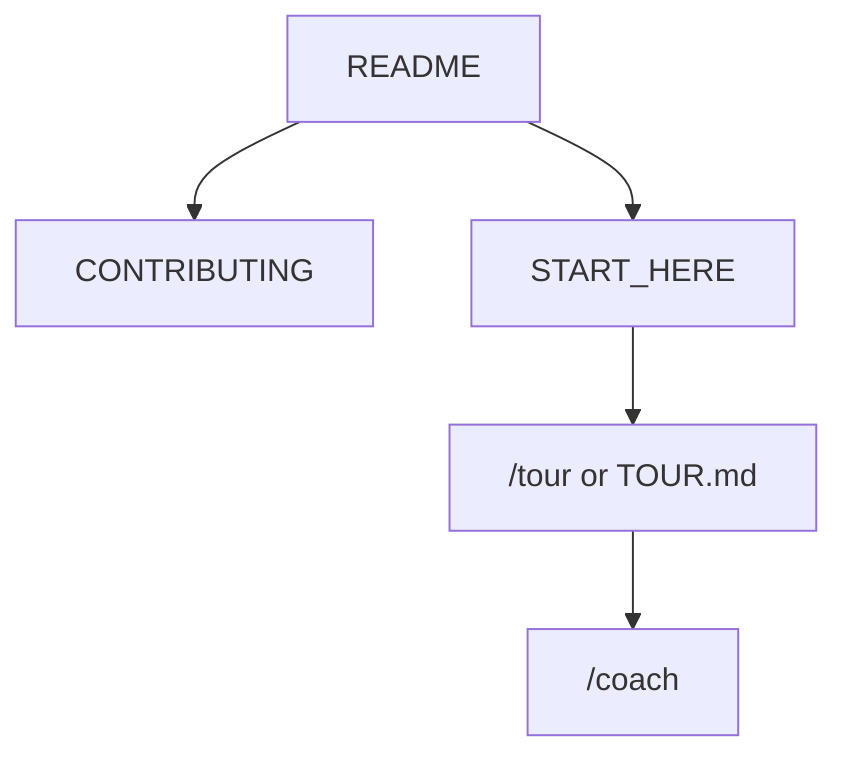

<!-- GENERATED by scripts/generate-project-readme.py — edit branding/product.json -->

  

<h1 align="center">ExpeditionGauge</h1>

<strong>Offline-first automotive HUD with recording and playback</strong>

  
  
  
  
  
  

  

## Pitch

ExpeditionGauge is a FOSS Compose HUD for off-road and track driving: gauges, GPS/IMU fusion, BLE sensors, session recording, and playback.

## Demo

  

> Add screenshots or a short demo GIF under `docs/images/` and link them here when available.

## Features

- Compose HUD gauges with GPS/IMU fusion and BLE sensors
- Session recording and playback with export
- Android Auto Drive HUD (FOSS, no Play Services)
- OBD-II Classic readout including immediate DTC scan on connect
- Offline-first MIT FOSS with Dependabot, CodeQL, and gitleaks defaults

## Quick start

1. Clone the repo and open it in Cursor. Follow `docs/START_HERE.md`. First-time walk: `docs/help/TOUR.md` (Cursor: `/tour`).
2. Build the Android app from `examples/android/` (package `dev.foss.expeditiongauge`).
3. Use `/upgrade` to catch up template machinery; never run `init-project.sh` on this child.

## For humans

Start with this README, then [`CONTRIBUTING.md`](../../CONTRIBUTING.md) and [`docs/BEST_PRACTICES.md`](../../docs/BEST_PRACTICES.md). The first-month playbook is [`docs/FIRST_30_DAYS.md`](../../docs/FIRST_30_DAYS.md).

## For agents

Read [`docs/START_HERE.md`](../../docs/START_HERE.md) and [`AGENTS.md`](../../AGENTS.md). In Cursor type `/tour` or `/bootstrap`. Any other IDE: ask the agent to read [`docs/help/TOUR.md`](../../docs/help/TOUR.md). `/coach` is the next recommended action.

## Install

Android SDK / JDK 21. See `modules/android/MODULE.md` and `examples/android/README.md`.

## Usage

Use `/build` for the next BUILD_PLAN `[AGENT]` row and `/verify` before merge. Device work uses `scripts/expedition/*.ps1`.

## Configuration

Copy [`.env.example`](../../.env.example) to `.env` for local secrets (never commit `.env`). Stack-specific config lives in the active `examples/` or app root after prune.

## Contributing

See [`../../CONTRIBUTING.md`](../../CONTRIBUTING.md). Prefer small PRs; follow Conventional Commits and the BUILD_PLAN labels (`AGENT` / `HUMAN` / `ADB` / `AUTO`). Status markers: 🔲 open · ✅ done · ❌ blocked.

## Security

See [`../../SECURITY.md`](../../SECURITY.md). Enable Dependabot alerts and follow [`docs/SECURITY_TRIAGE.md`](../../docs/SECURITY_TRIAGE.md) for weekly CVE triage.

## License

[MIT License](../../LICENSE) — see the license file for terms.

## Acknowledgments

Scaffolded with [agent-project-bootstrap](https://github.com/edwardlthompson/agent-project-bootstrap). Brand assets: [`../BRANDING.md`](../BRANDING.md). Design system: [`../../docs/DESIGN_GUIDE.md`](../../docs/DESIGN_GUIDE.md).
