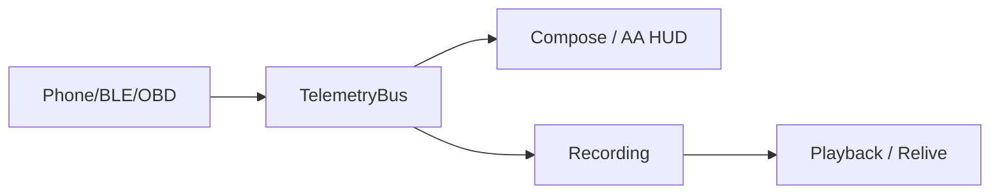

# Product Specification

> Spec-driven stub for ExpeditionGauge. Feature slices live in `docs/features/{name}.md`.
> Status markers: 🔲 open · ✅ done · ❌ blocked.

## Overview

**Product:** ExpeditionGauge  
**Purpose:** Offline-first automotive HUD with recording and playback  
**Users:** Drivers using the Android FOSS app and Android Auto Drive HUD.

## Functional Requirements & User Stories

| ID | Story | Acceptance |
|----|-------|------------|
| FR-1 | As a driver I see live gauges so I can drive without a phone glance | Compose HUD + AA Surface stay readable |
| FR-2 | As a driver I record a session so I can relive it later | Room session + playback map |
| FR-3 | As a driver I see OBD DTCs after the adapter connects | Mode 03/07 on confirmed handshake |

## Non-Functional Constraints

- MIT FOSS; no Play Services / Firebase in the APK
- Opt-in telemetry only
- File budgets: 300 lines static data, 150 lines pure logic
- Active board: `BUILD_PLAN.md`

## Architecture & Data Flow

Active architecture notes: `BUILD_PLAN.md`, `docs/adr/`.
